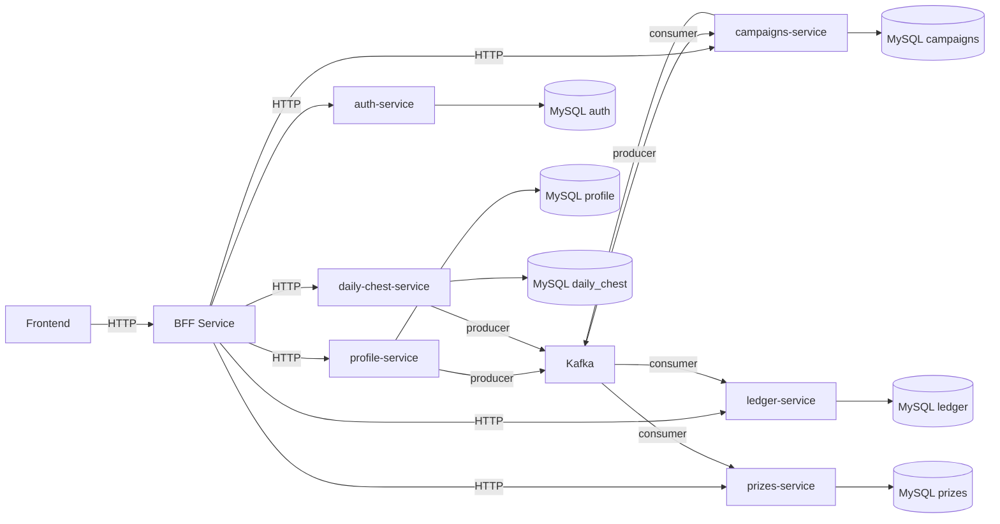
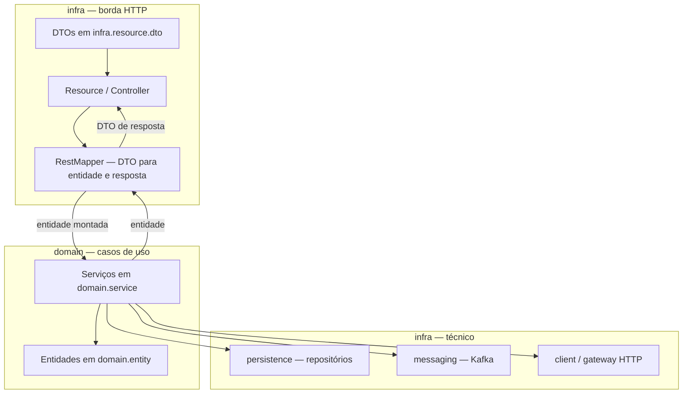
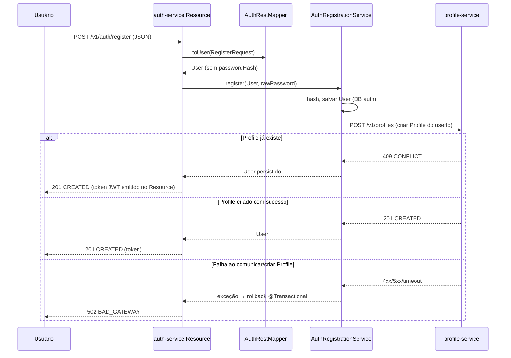
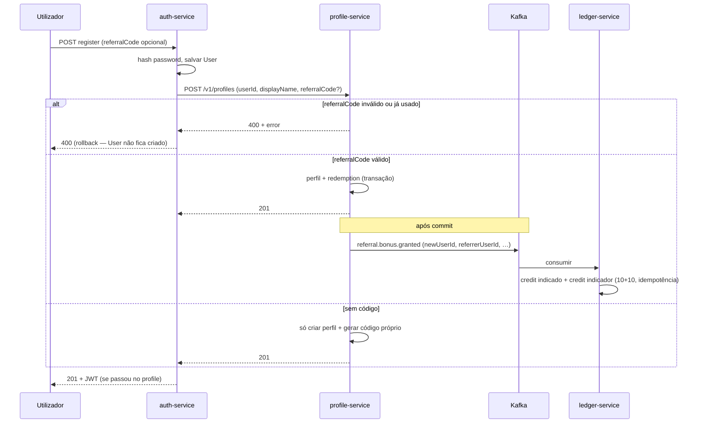
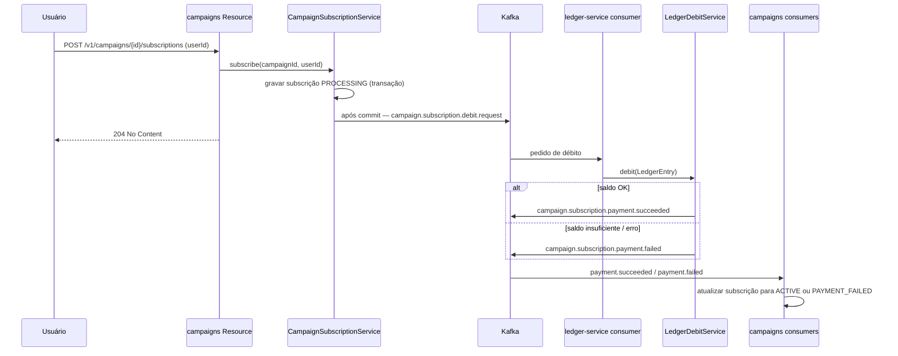
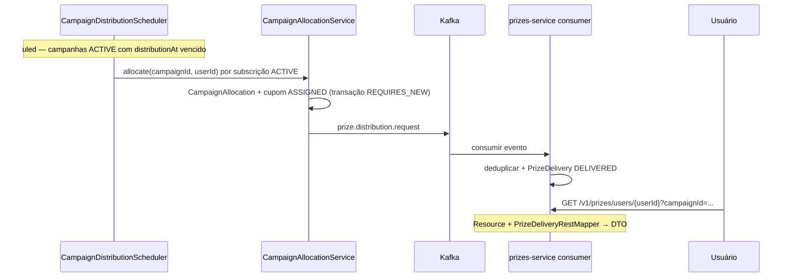
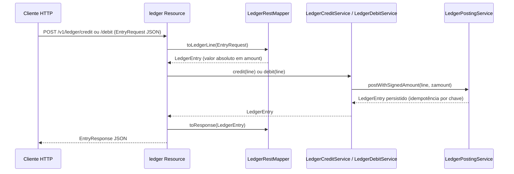
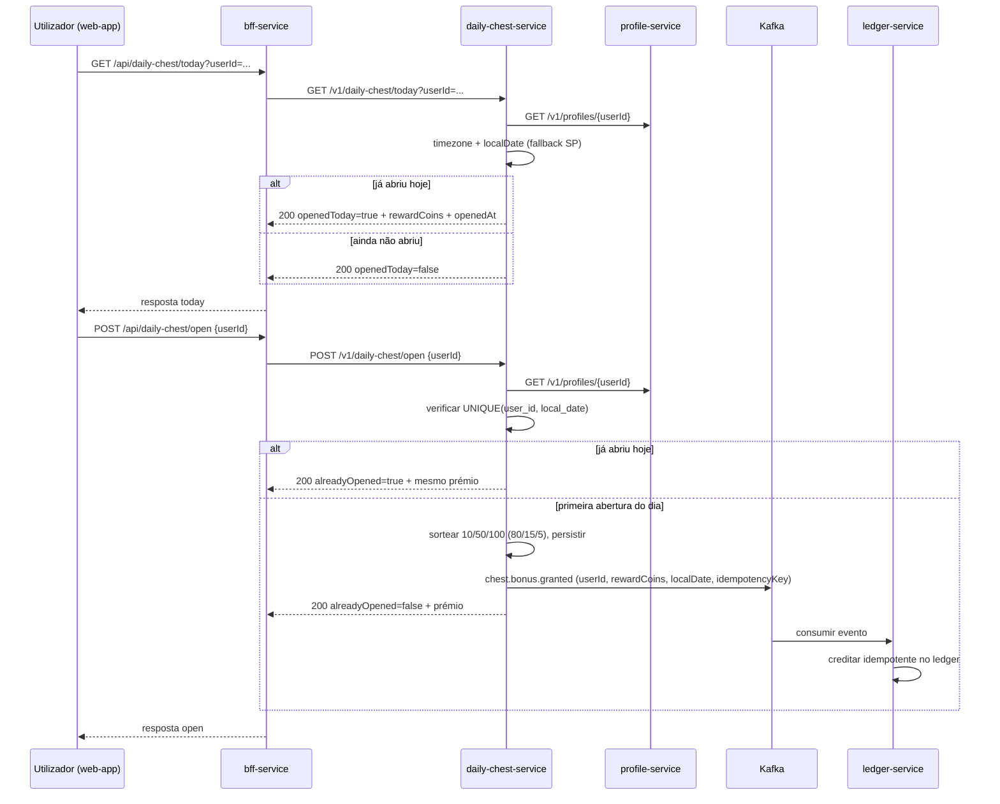
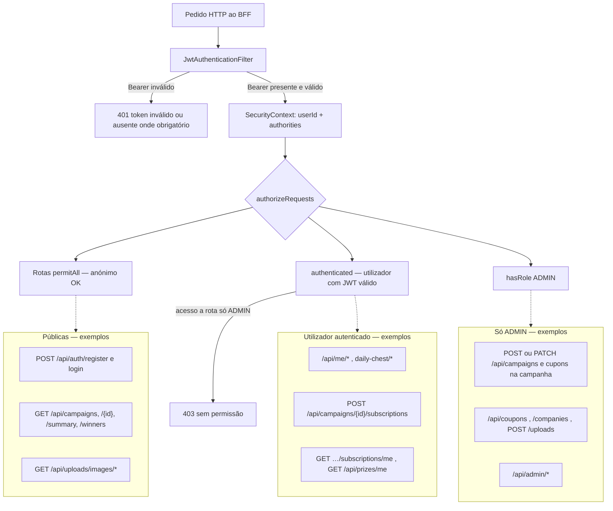

# Diagramas

## 1) Arquitetura (componentes)



**Tópicos Kafka relevantes (nomes por defeito):** `campaign.subscription.debit.request` → ledger; `campaign.subscription.payment.succeeded` / `campaign.subscription.payment.failed` → campaigns; `prize.distribution.request` → prizes; `referral.bonus.granted` (profile → ledger, bónus de indicação no registo); `chest.bonus.granted` (daily-chest → ledger, crédito diário do baú).

---

## 2) Borda HTTP: Resource, mapper e serviços (por microsserviço)



Os serviços **não** referenciam DTOs de API; quem converte pedido/resposta é o **mapper** na mesma camada que o `Resource`.

---

## 3) Registro no auth cria profile (E2E síncrono)



**Indicação (`referralCode`):** quando presente no registo, o `profile-service` valida de forma **síncrona** (código existente, ainda não usado, não auto-indicação); o detalhe está na **secção 4**. O bónus em pontos é **assíncrono** via Kafka (`referral.bonus.granted`).

---

## 4) Registo com código de indicação: validação no profile + bónus no ledger

Fluxo quando o utilizador envia `referralCode` no `POST /v1/auth/register` (ou BFF `/api/auth/register`). A validação e a gravação da redenção (`referral_redemptions`) ocorrem **na mesma transação** do perfil; a mensagem Kafka só é enviada **após commit** (`@TransactionalEventListener`).



---

## 5) Inscrição na campanha: débito assíncrono (Kafka) e estado da subscrição



---

## 6) Distribuição de prémio (agendador + Kafka) e consulta no prizes



**Retry:** `PrizeDispatchRetryService` consulta `PrizesGateway` e pode republicar no mesmo tópico quando o prémio ainda não está confirmado como entregue.

---

## 7) Crédito / débito direto no ledger (REST)

API exposta pelo `ledger-service` **sem passar pelo BFF**. Não faz parte do fluxo “utilizador → BFF” nem substitui os débitos/créditos assíncronos (Kafka) das subscrições ou do bónus de indicação.

**Para que serve hoje:** sobretudo **testes de integração** (`coupons-it`), que creditam pontos via `POST /v1/ledger/credit` antes de subscrever campanhas — no produto não existe outro endpoint público para “carregar” saldo. Também permite **ajustes manuais** (admin/ferramentas) se alguém chamar o ledger diretamente.

**Remover estes endpoints** implicaria alterar os testes de integração (ou outra forma de injetar saldo).



---

## 8) Baú da Sorte diário: abertura idempotente + crédito assíncrono no ledger

Fluxo implementado:
- frontend chama BFF (`/api/daily-chest/today` e `/api/daily-chest/open`);
- BFF apenas faz proxy para `daily-chest-service`;
- `daily-chest-service` resolve timezone via `profile-service` (fallback `America/Sao_Paulo`);
- garante abertura única por `(user_id, local_date)` e publica evento `chest.bonus.granted`;
- `ledger-service` consome e credita com `reason=DAILY_CHEST_BONUS`, `refType=DAILY_CHEST`, `refId=localDate`.



---

## 9) Frontend autenticado: FAB do Baú da Sorte

No `web-app`, o `DailyChestFab` foi integrado no `AuthenticatedLayout` (aparece em todas as páginas autenticadas, acima do bottom nav):
- estado inicial via `GET /api/daily-chest/today`;
- ao abrir: animação local de suspense (1.5s–2.5s) + `POST /api/daily-chest/open`;
- após sucesso: mostra resultado e dispara evento `coupons:balance-refresh` para atualizar saldo em `Home` e `Conta`.

```mermaid
flowchart LR
  L[AuthenticatedLayout] --> FAB[DailyChestFab]
  FAB -->|GET today| BFF[/api/daily-chest/today]
  FAB -->|POST open| BFF2[/api/daily-chest/open]
  FAB -->|window event| EVT[coupons:balance-refresh]
  EVT --> HOME[HomePage recarrega saldo]
  EVT --> ACCOUNT[AccountPage recarrega saldo]
```

---

## 10) Autenticação e autorização (web-app → BFF → auth-service)

**Princípio:** o **browser** fala só com o **BFF**. O JWT é emitido pelo **auth-service** e **validado no BFF** (mesma chave HMAC `JWT_SECRET`). O `userId` em operações “minhas” vem do **`sub` do token**, não de parâmetros confiáveis do cliente.

### 10.1) Login e uso do token no frontend

```mermaid
sequenceDiagram
  participant W as web-app
  participant B as bff-service
  participant A as auth-service

  W->>B: POST /api/auth/register ou /api/auth/login (sem Bearer)
  B->>A: POST /v1/auth/register ou /v1/auth/login
  A->>A: User + role (USER por defeito; ADMIN na BD)
  A-->>B: AuthResponse (token, userId, email, name, roles[])
  B-->>W: AuthTokenResponse (mesmo formato)

  Note over W: localStorage: token + userId + roles (UI)

  W->>B: GET /api/me/balance (Authorization: Bearer JWT)
  B->>B: filtro JWT — assinatura, exp, claims
  alt token válido
    B->>B: SecurityContext com userId = sub + ROLE_*
    B->>B: MeProxyResource usa utilizador autenticado
    B-->>W: 200
  else sem token / inválido / expirado
    B-->>W: 401 Não autenticado
  end
```

### 10.2) Classificação das rotas no BFF (política)



### 10.3) Conteúdo do JWT (auth-service)

| Claim / campo | Uso |
|---------------|-----|
| `sub` | UUID do utilizador (fonte de verdade no BFF) |
| `email` | E-mail |
| `roles` | Lista com `USER` e/ou `ADMIN` (Spring usa `ROLE_USER`, `ROLE_ADMIN`) |
| `exp` / `iat` | Validade e emissão |

**Bootstrap de admin:** variável `AUTH_BOOTSTRAP_ADMIN_EMAILS` (auth-service) promove contas existentes a `ADMIN` ao arranque; na BD a coluna `users.role` guarda `USER` ou `ADMIN`.

---

*Diagramas alinhados ao código atual (Resource + RestMapper, Kafka para subscrição/débito, indicação no registo, Baú da Sorte diário com crédito assíncrono no ledger, FAB no frontend autenticado, e JWT + roles no BFF).*
