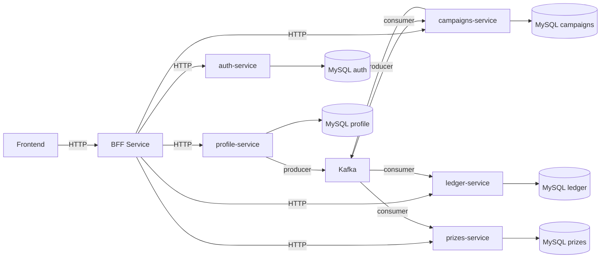
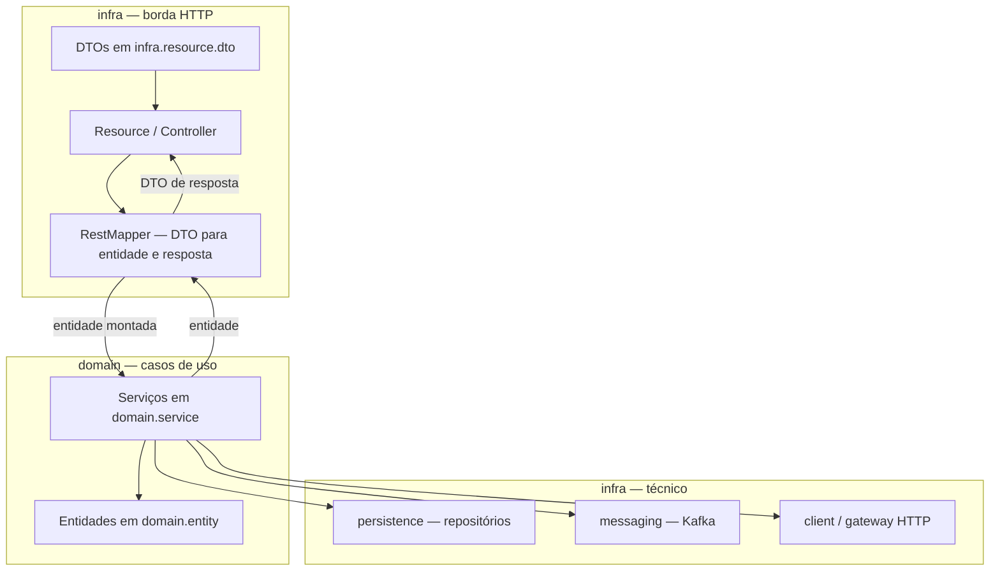
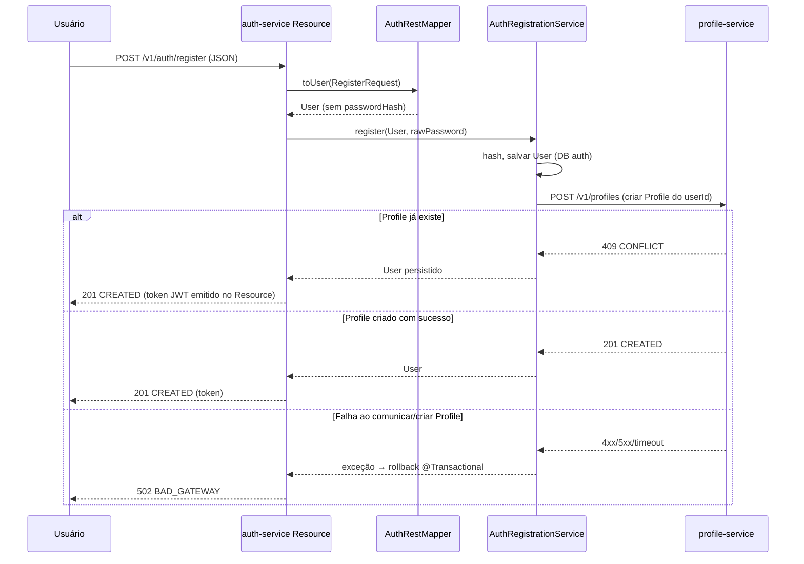
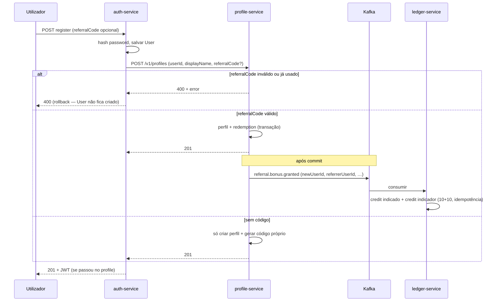
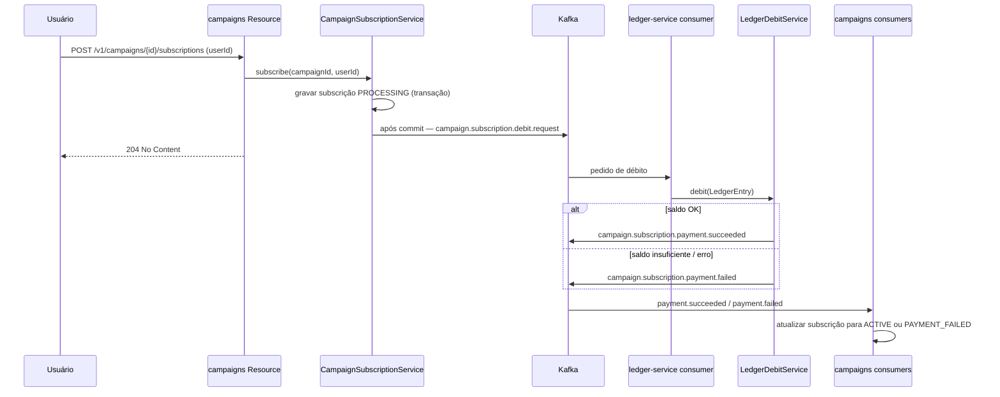
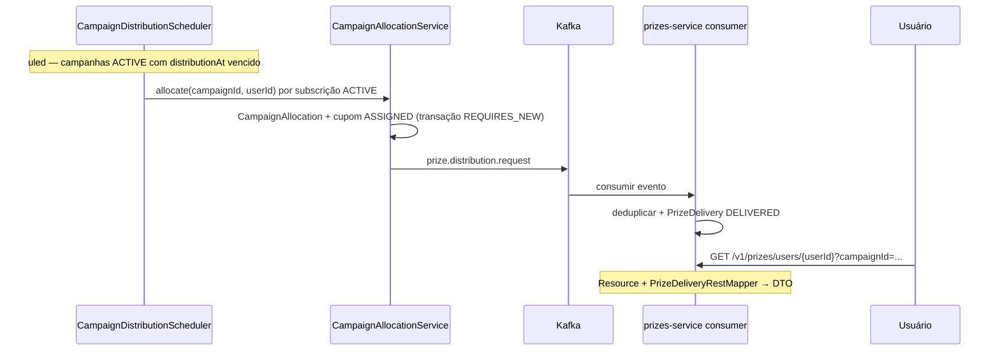
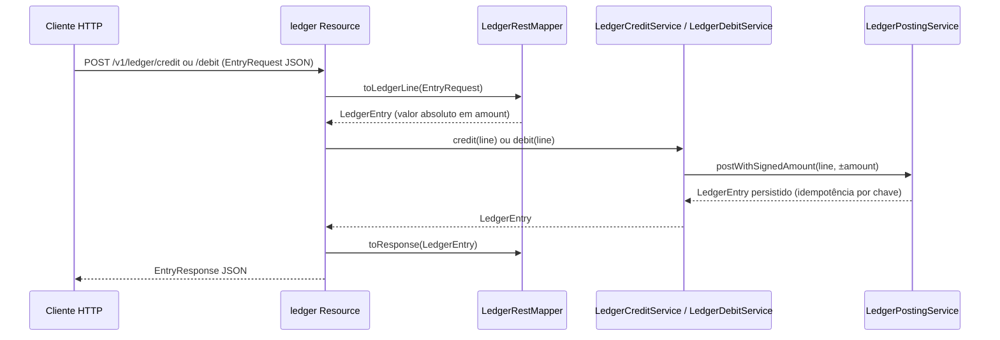

# Diagramas

## 1) Arquitetura (componentes)

**Tópicos Kafka relevantes (nomes por defeito):** `campaign.subscription.debit.request` → ledger; `campaign.subscription.payment.succeeded` / `campaign.subscription.payment.failed` → campaigns; `prize.distribution.request` → prizes; `referral.bonus.granted` (profile → ledger, bónus de indicação no registo).

---

## 2) Borda HTTP: Resource, mapper e serviços (por microsserviço)

Os serviços **não** referenciam DTOs de API; quem converte pedido/resposta é o **mapper** na mesma camada que o `Resource`.

---

## 3) Registro no auth cria profile (E2E síncrono)

**Indicação (`referralCode`):** quando presente no registo, o `profile-service` valida de forma **síncrona** (código existente, ainda não usado, não auto-indicação); o detalhe está na **secção 4**. O bónus em pontos é **assíncrono** via Kafka (`referral.bonus.granted`).

---

## 4) Registo com código de indicação: validação no profile + bónus no ledger

Fluxo quando o utilizador envia `referralCode` no `POST /v1/auth/register` (ou BFF `/api/auth/register`). A validação e a gravação da redenção (`referral_redemptions`) ocorrem **na mesma transação** do perfil; a mensagem Kafka só é enviada **após commit** (`@TransactionalEventListener`).

---

## 5) Inscrição na campanha: débito assíncrono (Kafka) e estado da subscrição

---

## 6) Distribuição de prémio (agendador + Kafka) e consulta no prizes

**Retry:** `PrizeDispatchRetryService` consulta `PrizesGateway` e pode republicar no mesmo tópico quando o prémio ainda não está confirmado como entregue.

---

## 7) Crédito / débito direto no ledger (REST)

API exposta pelo `ledger-service` **sem passar pelo BFF**. Não faz parte do fluxo “utilizador → BFF” nem substitui os débitos/créditos assíncronos (Kafka) das subscrições ou do bónus de indicação.

**Para que serve hoje:** sobretudo **testes de integração** (`coupons-it`), que creditam pontos via `POST /v1/ledger/credit` antes de subscrever campanhas — no produto não existe outro endpoint público para “carregar” saldo. Também permite **ajustes manuais** (admin/ferramentas) se alguém chamar o ledger diretamente.

**Remover estes endpoints** implicaria alterar os testes de integração (ou outra forma de injetar saldo).

---

*Diagramas alinhados ao código atual (Resource + RestMapper, Kafka para subscrição/débito, indicação no registo, schedulers de campanhas).*
