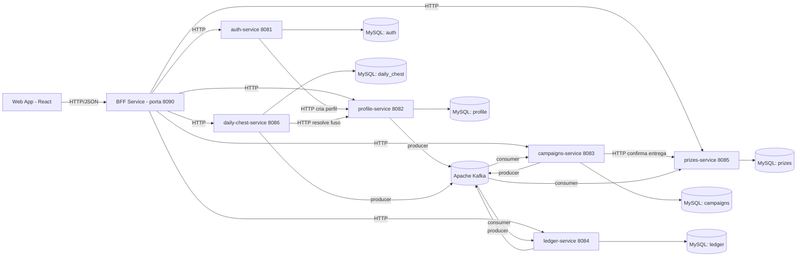
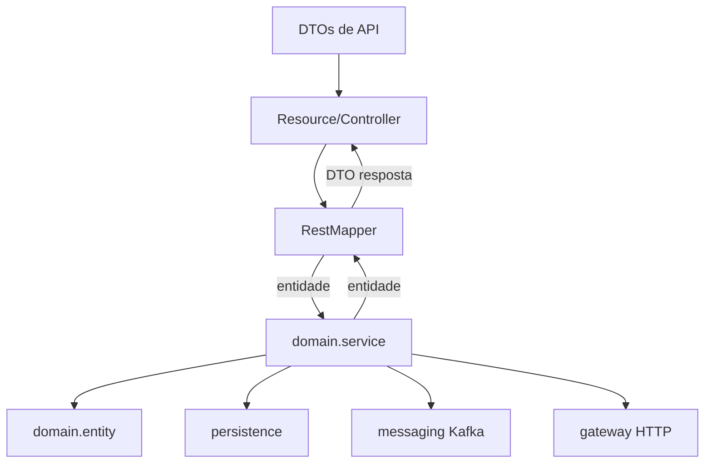
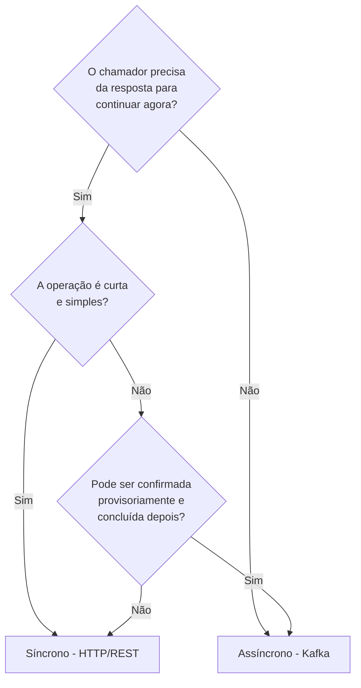
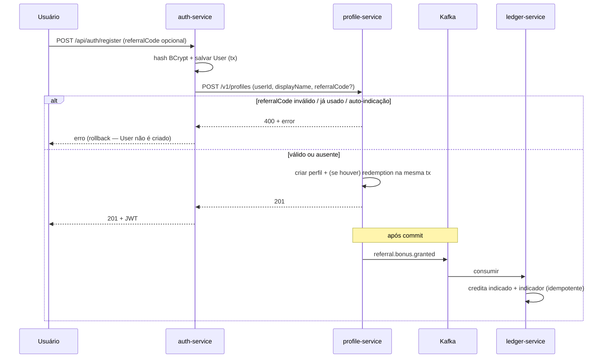
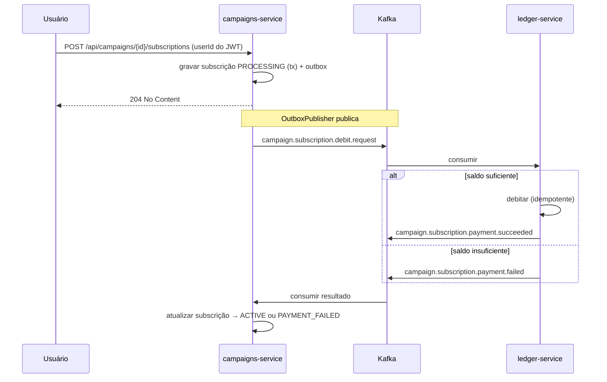
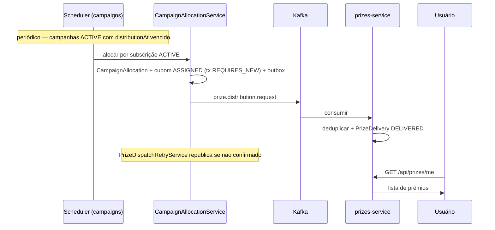
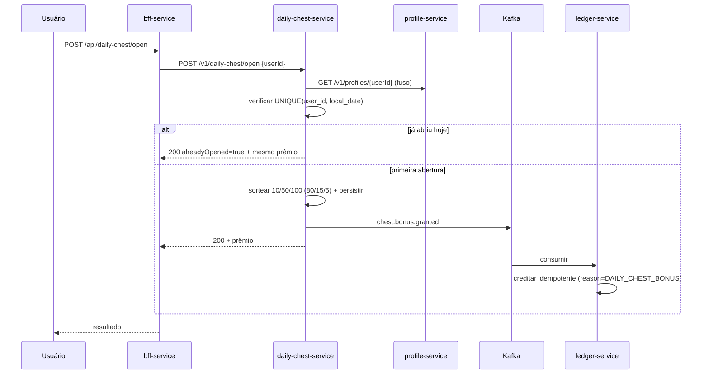
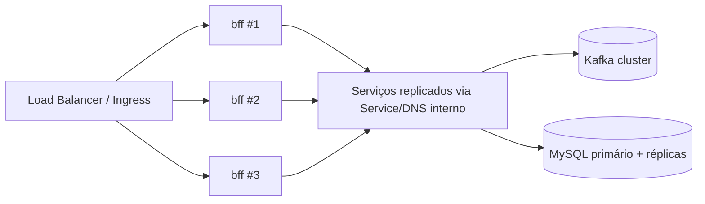
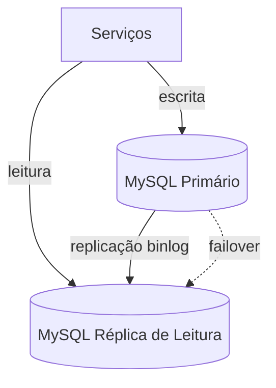

---

UNIVERSIDADE — DISCIPLINA DE SISTEMAS DISTRIBUÍDOS

  
  
  
  


# ESPECIFICAÇÃO DE SISTEMA DISTRIBUÍDO

## Plataforma de Cupons, Campanhas de Sorteio e Pontos de Fidelidade

  
  
  
  


Documento de Especificação Técnica e Arquitetural

  
  
  
  


**Autores:** Grupo (preencher integrantes)
**Disciplina:** Sistemas Distribuídos
**Orientador(a):** (preencher)
**Versão:** 1.0
**Local e data:** (Cidade), 2026

---


## RESUMO

Este documento especifica, de forma completa e autossuficiente, uma plataforma distribuída de cupons, campanhas de sorteio e pontos de fidelidade. O sistema permite que usuários se cadastrem, acumulem pontos (por indicação de novos usuários e por um "baú diário" de recompensas), inscrevam-se em campanhas que sorteiam cupons promocionais e, posteriormente, consultem os prêmios recebidos. A especificação adota uma arquitetura de **microsserviços** com um padrão **Backend-for-Frontend (BFF)** como única porta de entrada para o cliente web. A comunicação entre serviços ocorre de duas formas, deliberadamente escolhidas conforme o tipo de operação: **síncrona** (HTTP/REST) para consultas e fluxos que exigem resposta imediata e consistência forte na borda, e **assíncrona** (mensageria via Apache Kafka) para operações de longa duração, desacoplamento temporal e garantia de entrega eventual (débito de pontos, distribuição de prêmios, bônus de indicação e bônus do baú diário). Persistência adota o padrão **banco de dados por serviço** (*database-per-service*) sobre **MySQL 8**, garantindo autonomia e baixo acoplamento. São especificados os contratos de API, os contratos de mensagens, os modelos de dados, os mecanismos de segurança (JWT e chave interna de serviço), os padrões de confiabilidade (*outbox*, idempotência, *retry*) e a estratégia de implantação em produção, incluindo **replicação dos serviços** (instâncias *stateless* atrás de balanceador), **replicação do banco de dados** (topologia primário-réplica) e **cluster Kafka** com fator de replicação adequado. O documento serve como guia de implementação suficiente para que uma equipe construa o sistema integralmente a partir do zero.

**Palavras-chave:** Sistemas Distribuídos. Microsserviços. Mensageria Assíncrona. Apache Kafka. Backend-for-Frontend. Consistência Eventual. Replicação.

---


## SUMÁRIO

1. INTRODUÇÃO
  - 1.1 Contexto e Motivação
  - 1.2 Objetivos
  - 1.3 Escopo
  - 1.4 Glossário de Termos
2. VISÃO GERAL DO SISTEMA
  - 2.1 Domínio do Problema
  - 2.2 Atores e Papéis
  - 2.3 Funcionalidades Principais
3. REQUISITOS
  - 3.1 Requisitos Funcionais
  - 3.2 Requisitos Não Funcionais
4. ARQUITETURA DO SISTEMA
  - 4.1 Estilo Arquitetural
  - 4.2 Visão de Componentes
  - 4.3 Decisões Arquiteturais (ADR)
  - 4.4 Estrutura Interna Padrão dos Serviços
5. COMUNICAÇÃO ENTRE SERVIÇOS
  - 5.1 Comunicação Síncrona (HTTP/REST)
  - 5.2 Comunicação Assíncrona (Mensageria)
  - 5.3 Critérios de Decisão: Síncrono vs. Assíncrono
6. ESPECIFICAÇÃO DOS SERVIÇOS
  - 6.1 BFF Service
  - 6.2 Auth Service
  - 6.3 Profile Service
  - 6.4 Campaigns Service
  - 6.5 Ledger Service
  - 6.6 Prizes Service
  - 6.7 Daily Chest Service
  - 6.8 Web App (Frontend)
7. MENSAGERIA E EVENTOS (APACHE KAFKA)
  - 7.1 Tópicos e Contratos
  - 7.2 Padrões de Confiabilidade
8. PERSISTÊNCIA DE DADOS
  - 8.1 Escolha da Tecnologia
  - 8.2 Banco de Dados por Serviço
  - 8.3 Modelos de Dados (Esquemas)
9. SEGURANÇA
10. FLUXOS DE NEGÓCIO (CASOS DE USO DETALHADOS)
11. IMPLANTAÇÃO E OPERAÇÃO EM PRODUÇÃO
  - 11.1 Empacotamento e Imagens
    - 11.2 Replicação dos Serviços
    - 11.3 Replicação do Banco de Dados
    - 11.4 Cluster Kafka em Produção
    - 11.5 Orquestração e Escalabilidade
    - 11.6 Configuração por Ambiente
12. OBSERVABILIDADE E CONFIABILIDADE
13. ESTRATÉGIA DE TESTES
14. CONCLUSÃO
15. REFERÊNCIAS

---


# 1 INTRODUÇÃO

## 1.1 Contexto e Motivação

Aplicações modernas de engajamento e fidelidade precisam combinar operações de naturezas muito distintas: cadastros e autenticações que exigem resposta imediata; transações de pontos que devem ser consistentes e auditáveis; e processos de longa duração — como sorteios e distribuição de prêmios em massa — que não podem bloquear o usuário nem comprometer a disponibilidade do sistema sob carga.

Construir todas essas capacidades em um único processo monolítico levaria a um forte acoplamento, a um ciclo de implantação único (qualquer mudança exige reimplantar tudo) e à dificuldade de escalar apenas as partes sobrecarregadas. Por isso, este documento especifica o sistema sob o paradigma de **sistemas distribuídos**, decompondo-o em microsserviços autônomos que se comunicam por mecanismos síncronos e assíncronos, cada qual aplicado onde traz mais benefício.

O propósito didático deste documento, no âmbito da disciplina de Sistemas Distribuídos, é demonstrar e justificar as decisões arquiteturais inerentes a sistemas distribuídos reais: decomposição em serviços, escolha entre comunicação síncrona e assíncrona, consistência eventual, idempotência, tolerância a falhas, replicação de serviços e de dados, e estratégias de implantação.

## 1.2 Objetivos

**Objetivo geral:** especificar uma plataforma distribuída de cupons e sorteios com nível de detalhe suficiente para que uma equipe a implemente do zero.

**Objetivos específicos:**

- a) Definir a decomposição do sistema em serviços e suas responsabilidades.
- b) Especificar os contratos de API (REST) e os contratos de mensagens (Kafka).
- c) Justificar tecnicamente o uso de comunicação síncrona e assíncrona, indicando onde cada uma é aplicada.
- d) Definir a estratégia de persistência e os modelos de dados.
- e) Especificar os mecanismos de segurança e os padrões de confiabilidade (idempotência, *outbox*, *retry*).
- f) Definir a topologia de produção, incluindo replicação de serviços e do banco de dados.

## 1.3 Escopo

**Está no escopo:** cadastro/autenticação de usuários; perfis e códigos de indicação; gestão de empresas, cupons e campanhas; inscrição em campanhas com débito de pontos; sorteio/alocação e distribuição de prêmios; razão (*ledger*) de pontos; baú de recompensas diário; consulta de prêmios; aplicação web cliente; e a topologia distribuída de produção.

**Está fora do escopo:** integração com gateways de pagamento financeiro real (os "pontos" são uma moeda interna); aplicativos móveis nativos; campanhas de marketing por e-mail/push; e relatórios analíticos avançados (*BI*). Esses itens são mencionados apenas como possíveis evoluções.

## 1.4 Glossário de Termos


| Termo                          | Definição                                                                                              |
| ------------------------------ | ------------------------------------------------------------------------------------------------------ |
| **Microsserviço**              | Serviço autônomo, com banco próprio e ciclo de implantação independente.                               |
| **BFF (Backend-for-Frontend)** | Serviço de borda que agrega/orquestra chamadas aos demais e é a única API exposta ao cliente.          |
| **Cupom**                      | Código promocional com validade, mantido em inventário e potencialmente sorteado em campanhas.         |
| **Campanha**                   | Evento com janela de inscrições e data de distribuição, no qual usuários inscritos concorrem a cupons. |
| **Ledger (Razão)**             | Registro contábil *append-only* de créditos e débitos de pontos por usuário.                           |
| **Pontos**                     | Moeda interna de fidelidade; saldo do usuário é a soma de suas linhas no *ledger*.                     |
| **Idempotência**               | Propriedade de uma operação produzir o mesmo efeito ainda que executada múltiplas vezes.               |
| **Outbox**                     | Padrão que grava o evento a publicar na mesma transação do dado, garantindo publicação confiável.      |
| **Consistência eventual**      | Garantia de que réplicas/estados convergem após algum tempo, sem consistência imediata global.         |
| **JWT**                        | *JSON Web Token*; credencial assinada usada para autenticação/autorização sem estado.                  |


---


# 2 VISÃO GERAL DO SISTEMA

## 2.1 Domínio do Problema

O sistema é uma plataforma de fidelidade na qual **empresas** patrocinam **campanhas** de sorteio de **cupons** promocionais. **Usuários** acumulam **pontos** (moeda interna) e gastam parte desses pontos para se **inscrever** em campanhas. Quando a janela de inscrições encerra e a **data de distribuição** é atingida, o sistema **aloca** cupons aos inscritos e **entrega** os **prêmios** correspondentes, que ficam disponíveis para consulta.

Os pontos podem ser obtidos por dois mecanismos especificados: **indicação** (quando um novo usuário se cadastra usando o código de outro, ambos recebem bônus) e **baú diário** (recompensa aleatória que o usuário pode resgatar uma vez por dia).

## 2.2 Atores e Papéis

- **Visitante:** acessa telas públicas de cadastro e login.
- **Usuário (`USER`):** cadastrado e autenticado; gerencia seu perfil, consulta saldo, inscreve-se em campanhas, abre o baú diário e consulta prêmios.
- **Administrador (`ADMIN`):** além das capacidades do usuário, cria/edita empresas, cupons e campanhas, faz upload de imagens, busca usuários e pode lançar créditos manuais no *ledger*.
- **Atores de sistema:** agendadores internos (distribuição de campanhas, *retry* de despacho, publicador de *outbox*) que disparam fluxos sem intervenção humana.

## 2.3 Funcionalidades Principais

1. Cadastro e autenticação de usuários (com indicação opcional).
2. Gestão de perfil e geração de código de indicação.
3. Gestão administrativa de empresas, cupons e campanhas.
4. Inscrição em campanhas com débito assíncrono de pontos.
5. Sorteio/alocação automática e distribuição assíncrona de prêmios.
6. Razão de pontos (crédito/débito idempotente) e consulta de saldo.
7. Baú de recompensas diário com crédito assíncrono.
8. Consulta de prêmios recebidos.

---


# 3 REQUISITOS

## 3.1 Requisitos Funcionais


| ID   | Requisito                                                                                                                                        |
| ---- | ------------------------------------------------------------------------------------------------------------------------------------------------ |
| RF01 | O sistema deve permitir cadastro de usuário com e-mail, senha e nome, opcionalmente com código de indicação.                                     |
| RF02 | O sistema deve autenticar usuários por e-mail e senha, retornando um token JWT.                                                                  |
| RF03 | Ao cadastrar um usuário, o sistema deve criar automaticamente o perfil correspondente e gerar um código de indicação único.                      |
| RF04 | Quando um cadastro usar um código de indicação válido e ainda não utilizado, o sistema deve conceder bônus de pontos ao indicado e ao indicador. |
| RF05 | O sistema deve permitir que administradores cadastrem empresas (com CNPJ único).                                                                 |
| RF06 | O sistema deve permitir que administradores criem cupons no inventário (com código único e validade).                                            |
| RF07 | O sistema deve permitir que administradores criem campanhas com janela de inscrições, data de distribuição e custo em pontos.                    |
| RF08 | O sistema deve permitir vincular cupons a uma campanha com uma prioridade.                                                                       |
| RF09 | O sistema deve permitir que usuários autenticados se inscrevam em campanhas, debitando o custo em pontos.                                        |
| RF10 | O sistema deve impedir saldo negativo: inscrição cujo débito falhe por saldo insuficiente deve ser marcada como falha de pagamento.              |
| RF11 | O sistema deve, ao atingir a data de distribuição de uma campanha, alocar cupons às inscrições ativas e registrar a entrega do prêmio.           |
| RF12 | O sistema deve permitir que usuários consultem os prêmios que receberam.                                                                         |
| RF13 | O sistema deve permitir consultar o saldo de pontos do usuário.                                                                                  |
| RF14 | O sistema deve permitir que cada usuário abra o baú diário uma única vez por dia (no fuso do perfil), creditando uma recompensa aleatória.       |
| RF15 | O sistema deve registrar todo crédito/débito de pontos de forma idempotente em uma razão *append-only*.                                          |
| RF16 | O sistema deve permitir que administradores busquem usuários e lancem créditos manuais.                                                          |


## 3.2 Requisitos Não Funcionais


| ID    | Categoria        | Requisito                                                                                                                                                                                    |
| ----- | ---------------- | -------------------------------------------------------------------------------------------------------------------------------------------------------------------------------------------- |
| RNF01 | Disponibilidade  | Os serviços de leitura (catálogo de campanhas, login) devem permanecer disponíveis mesmo sob carga de processos de distribuição; processos longos não devem bloquear requisições do usuário. |
| RNF02 | Escalabilidade   | Cada serviço deve ser *stateless* e escalável horizontalmente (múltiplas réplicas) de forma independente.                                                                                    |
| RNF03 | Desempenho       | Operações interativas (login, listagem de campanhas, inscrição) devem responder em tempo de borda; operações de massa devem ser assíncronas.                                                 |
| RNF04 | Consistência     | O saldo e o débito de pontos devem ser consistentes e auditáveis; estados de inscrição e prêmio podem convergir por consistência eventual.                                                   |
| RNF05 | Confiabilidade   | Nenhum evento de negócio (débito, prêmio, bônus) pode ser perdido; o sistema deve tolerar falhas transitórias com *retry* e idempotência.                                                    |
| RNF06 | Segurança        | Todo acesso externo deve passar pelo BFF, com autenticação JWT; comunicação interna deve ser autenticada por chave de serviço.                                                               |
| RNF07 | Isolamento       | Cada serviço deve ter banco de dados próprio, sem acesso direto ao banco de outro serviço.                                                                                                   |
| RNF08 | Portabilidade    | O sistema deve ser empacotado em contêineres e executável via orquestrador, sem dependência de máquina específica.                                                                           |
| RNF09 | Observabilidade  | Cada serviço deve expor *endpoint* de *health check* e métricas mínimas.                                                                                                                     |
| RNF10 | Manutenibilidade | Os contratos de API e de mensagens devem ser versionados e documentados.                                                                                                                     |


---


# 4 ARQUITETURA DO SISTEMA

## 4.1 Estilo Arquitetural

O sistema adota o estilo de **microsserviços** orientado ao domínio, com um **Backend-for-Frontend (BFF)** atuando como *gateway* de borda. Os princípios norteadores são:

- **Decomposição por capacidade de negócio:** cada serviço encapsula um *bounded context* (autenticação, perfil, campanhas, razão de pontos, prêmios, baú diário).
- **Autonomia:** cada serviço tem seu próprio banco de dados e ciclo de implantação; não há banco compartilhado.
- **Comunicação explícita:** serviços se comunicam apenas por contratos públicos (REST e mensagens Kafka), nunca por acesso direto ao banco alheio.
- **Statelessness:** os serviços não guardam estado de sessão em memória; todo estado persistente fica no banco ou no broker, permitindo réplicas intercambiáveis.
- **Resiliência por mensageria:** processos longos e propagações de efeito são desacoplados via eventos.

## 4.2 Visão de Componentes

A figura a seguir (notação Mermaid) descreve os componentes e suas interações. As setas sólidas representam comunicação síncrona (HTTP); as setas via *broker* representam comunicação assíncrona (Kafka).




**Inventário de componentes:**


| Componente          | Porta padrão | Tipo                | Estado                  |
| ------------------- | ------------ | ------------------- | ----------------------- |
| web-app             | 3000         | Frontend (SPA)      | sem estado de servidor  |
| bff-service         | 8090         | Gateway/BFF         | *stateless* (sem banco) |
| auth-service        | 8081         | Microsserviço       | banco `auth`            |
| profile-service     | 8082         | Microsserviço       | banco `profile`         |
| campaigns-service   | 8083         | Microsserviço       | banco `campaigns`       |
| ledger-service      | 8084         | Microsserviço       | banco `ledger`          |
| prizes-service      | 8085         | Microsserviço       | banco `prizes`          |
| daily-chest-service | 8086         | Microsserviço       | banco `daily_chest`     |
| MySQL               | 3306         | Banco de dados      | persistente             |
| Apache Kafka        | 9092         | Broker de mensagens | persistente (log)       |


## 4.3 Decisões Arquiteturais (ADR)

A seguir registram-se as principais decisões arquiteturais no formato *Architecture Decision Record* (contexto → decisão → consequências).

### ADR-01 — Arquitetura de microsserviços com BFF

- **Contexto:** o sistema reúne capacidades heterogêneas (autenticação, contabilidade de pontos, processamento em massa de sorteios). Um monólito acoplaria escalabilidade e implantação.
- **Decisão:** decompor por domínio em microsserviços autônomos e expor um BFF único ao cliente.
- **Consequências:** (+) escalabilidade e implantação independentes, isolamento de falhas, contratos explícitos. (−) maior complexidade operacional (rede, observabilidade, consistência distribuída), necessidade de orquestração.

### ADR-02 — Padrão *Database-per-Service* sobre MySQL

- **Contexto:** isolamento de dados é requisito (RNF07); diferentes serviços têm modelos distintos.
- **Decisão:** cada serviço possui um *schema* próprio em MySQL, com usuário de banco dedicado e permissões restritas àquele *schema*. Não há *joins* entre serviços.
- **Consequências:** (+) baixo acoplamento, evolução independente do esquema, segurança por menor privilégio. (−) impossibilidade de transações ACID distribuídas; consistência entre serviços passa a ser eventual e coordenada por eventos/sagas.

### ADR-03 — Comunicação assíncrona via Apache Kafka para efeitos colaterais

- **Contexto:** débito de pontos na inscrição, distribuição de prêmios, bônus de indicação e baú diário propagam efeitos entre serviços e podem ser demorados ou volumosos.
- **Decisão:** propagar esses efeitos por eventos no Kafka, e não por chamadas síncronas encadeadas.
- **Consequências:** (+) desacoplamento temporal, tolerância a indisponibilidade momentânea do consumidor, absorção de picos (*buffering*), reprocessamento. (−) consistência eventual, necessidade de idempotência e de tratamento de duplicatas/ordem.

### ADR-04 — Comunicação síncrona (HTTP/REST) na borda e em consultas

- **Contexto:** o usuário precisa de respostas imediatas (login, listar campanhas, ver saldo). A criação de perfil no cadastro exige confirmação imediata.
- **Decisão:** usar HTTP/REST do cliente ao BFF e do BFF aos serviços, e para poucas chamadas serviço-a-serviço que exigem resposta imediata e validação na hora.
- **Consequências:** (+) simplicidade, resposta imediata, consistência forte na operação. (−) acoplamento temporal (se o destino cair, a chamada falha) — mitigado restringindo o uso síncrono a operações curtas e essenciais.

### ADR-05 — Padrão *Transactional Outbox* + idempotência

- **Contexto:** publicar um evento após gravar no banco pode falhar entre o *commit* e o *publish*, perdendo o evento (RNF05).
- **Decisão:** gravar o evento em uma tabela `outbox` na **mesma transação** do dado de negócio; um publicador assíncrono lê o *outbox* e publica no Kafka. Todo consumidor é idempotente (chave de idempotência única).
- **Consequências:** (+) garantia "*at-least-once*" sem perda; duplicatas toleradas por idempotência. (−) latência adicional do *polling* do *outbox*; necessidade de chaves de idempotência bem definidas.

### ADR-06 — Autenticação por JWT validada no BFF e nos serviços

- **Contexto:** serviços *stateless* não devem manter sessão; é preciso autorizar requisições externas e proteger chamadas internas.
- **Decisão:** o `auth-service` emite JWT (HMAC-SHA256); o BFF valida o JWT do cliente; as chamadas internas do BFF aos serviços levam uma **chave interna** (`X-Internal-Api-Key`) e/ou o JWT.
- **Consequências:** (+) autenticação sem estado, escalável; defesa em profundidade. (−) chave/segredo compartilhados exigem gestão de segredos.

## 4.4 Estrutura Interna Padrão dos Serviços

Para uniformidade e manutenibilidade (RNF10), **todos** os microsserviços devem seguir a mesma organização em camadas (arquitetura hexagonal simplificada):

```
src/main/java/com/coupons/<servico>/
├── infra/
│   ├── resource/        → Controllers REST (*Resource.java) + DTOs (infra.resource.dto)
│   │   └── mapper/       → RestMapper: converte DTO ↔ entidade (MapStruct)
│   ├── persistence/     → Repositórios Spring Data JPA
│   ├── messaging/       → Produtores e consumidores Kafka + DTOs de mensagem (messaging.dto)
│   └── gateway/         → Clientes HTTP para outros serviços
├── domain/
│   ├── service/         → Casos de uso / regras de negócio (NÃO conhecem DTOs de API)
│   └── entity/          → Entidades JPA
└── config/              → Configurações (segurança, beans, Kafka)
```

**Regra de dependência:** a camada `domain.service` não referencia DTOs de API; a conversão pedido/resposta é feita pelo *mapper* na mesma camada do `Resource`. Isso mantém o núcleo de negócio independente de detalhes de transporte.




---


# 5 COMUNICAÇÃO ENTRE SERVIÇOS

A escolha entre comunicação síncrona e assíncrona é uma das decisões centrais de um sistema distribuído. Esta seção define **onde** cada estilo é usado e **por quê**.

## 5.1 Comunicação Síncrona (HTTP/REST)

A comunicação síncrona é usada quando o chamador **precisa da resposta imediatamente** para prosseguir e quando a operação é **curta**. O formato é **JSON sobre HTTP**, com nomes de campo em *camelCase* e datas/instantes em ISO-8601 (UTC).

**Usos especificados de comunicação síncrona:**


| Origem → Destino                      | Operação                              | Por que síncrona                                                                                               |
| ------------------------------------- | ------------------------------------- | -------------------------------------------------------------------------------------------------------------- |
| Web App → BFF                         | Todas as ações do usuário             | O cliente precisa de resposta para renderizar a tela.                                                          |
| BFF → serviços                        | Proxy/orquestração de cada requisição | O BFF precisa compor a resposta ao cliente na hora.                                                            |
| auth-service → profile-service        | Criar perfil no cadastro              | O cadastro só pode ser confirmado se o perfil for criado (consistência imediata; *rollback* em caso de falha). |
| daily-chest-service → profile-service | Resolver o fuso horário do usuário    | Necessário para calcular a "data local" antes de registrar a abertura.                                         |
| campaigns-service → prizes-service    | Confirmar se o prêmio já foi entregue | O *retry* de despacho consulta o estado atual antes de republicar.                                             |


**Características exigidas:** *timeouts* configurados, tratamento de erro padronizado (corpo `{ "error": "..." }`), e idempotência onde aplicável. Falha em chamada síncrona deve resultar em erro imediato ao chamador (ex.: `502 Bad Gateway` quando o destino interno falha no cadastro).

## 5.2 Comunicação Assíncrona (Mensageria)

A comunicação assíncrona, via **Apache Kafka**, é usada quando o efeito **não precisa ser imediato para o usuário**, quando há **propagação de efeitos** entre domínios, quando é necessário **absorver picos** de carga, ou quando se quer **desacoplar** produtor e consumidor para que a indisponibilidade de um não derrube o outro.

O valor de cada mensagem é uma **string JSON (UTF-8)**; a chave (`key`) é uma string (geralmente UUID textual ou chave composta), usada para particionamento e ordenação por entidade.

**Usos especificados de comunicação assíncrona:**


| Fluxo                               | Tópico                                                | Por que assíncrona                                                                                                                                        |
| ----------------------------------- | ----------------------------------------------------- | --------------------------------------------------------------------------------------------------------------------------------------------------------- |
| Débito de pontos ao inscrever-se    | `campaign.subscription.debit.request`                 | A inscrição é confirmada de imediato (estado `PROCESSING`); o débito é processado pelo *ledger* e o resultado retorna por evento, sem bloquear o usuário. |
| Resultado do pagamento da inscrição | `campaign.subscription.payment.succeeded` / `.failed` | O *ledger* informa o resultado ao campaigns sem acoplamento síncrono.                                                                                     |
| Distribuição de prêmios             | `prize.distribution.request`                          | Pode envolver milhares de inscritos; processar em massa de forma assíncrona evita bloqueio e permite *retry*.                                             |
| Bônus de indicação                  | `referral.bonus.granted`                              | Efeito colateral do cadastro; não deve atrasar nem falhar o cadastro do usuário.                                                                          |
| Bônus do baú diário                 | `chest.bonus.granted`                                 | O usuário vê o prêmio na hora; o crédito no *ledger* ocorre em segundo plano de forma idempotente.                                                        |


## 5.3 Critérios de Decisão: Síncrono vs. Assíncrono

A regra de decisão adotada nesta especificação é:




| Critério                                  | Prefira Síncrono                      | Prefira Assíncrono             |
| ----------------------------------------- | ------------------------------------- | ------------------------------ |
| Necessidade de resposta                   | Imediata e obrigatória                | Pode ser eventual              |
| Duração da operação                       | Curta                                 | Longa ou em massa              |
| Acoplamento desejado                      | Aceitável (operação essencial)        | Baixo (isolar falhas)          |
| Tolerância a indisponibilidade do destino | Baixa                                 | Alta (mensagem fica no broker) |
| Consistência                              | Forte na operação                     | Eventual                       |
| Exemplos no sistema                       | Login, listar campanhas, criar perfil | Débito, prêmios, bônus         |


---


# 6 ESPECIFICAÇÃO DOS SERVIÇOS

**Pilha tecnológica comum a todos os serviços de backend** (recomendada; outra equipe pode adotar tecnologias equivalentes desde que respeite os contratos):

- Linguagem **Java 11**; framework **Spring Boot 2.7.x**; *build* com **Gradle 8.7**.
- **Spring Web** (REST), **Spring Data JPA** + **Hibernate** (gerenciamento de esquema `ddl-auto: update` em desenvolvimento; ver §8.1 para produção).
- Conector **MySQL 8**.
- **Spring Actuator** para *health checks* (`/actuator/health`, `/actuator/info`).
- **MapStruct** (mapeamento DTO↔entidade) e **Lombok**.
- **JJWT** (`io.jsonwebtoken`) para emissão/validação de JWT, onde aplicável.
- **Spring for Apache Kafka** (`spring-kafka`) nos serviços que produzem/consomem eventos.
- O BFF adiciona **Spring Security** e **Spring WebFlux** (`WebClient`).

Convenções de contrato: campos em *camelCase*; `UUID` e `Instant` serializados como *string* (UUID textual; ISO-8601 em UTC, ex. `2026-04-01T12:00:00Z`); erros no formato `{ "error": "mensagem" }`.

## 6.1 BFF Service

- **Porta:** 8090. **Banco:** nenhum (*stateless*).
- **Responsabilidade:** única API pública ao cliente; valida JWT; aplica autorização por papel; faz *proxy*/orquestração para os serviços via `WebClient`; armazena uploads de imagem localmente.
- **Comportamento de segurança:** em chamadas internas, injeta o cabeçalho `X-Internal-Api-Key` e repassa o `Authorization: Bearer` do cliente. O `userId` de operações "minhas" é obtido do *claim* `sub` do JWT, **nunca** do corpo enviado pelo cliente.

**Principais rotas (base `/api`):**


| Método                | Caminho                                | Autorização                 |
| --------------------- | -------------------------------------- | --------------------------- |
| POST                  | `/api/auth/register`                   | público                     |
| POST                  | `/api/auth/login`                      | público                     |
| GET                   | `/api/campaigns`                       | autenticado                 |
| GET                   | `/api/campaigns/{id}`                  | autenticado                 |
| POST                  | `/api/campaigns`                       | ADMIN                       |
| PATCH                 | `/api/campaigns/{id}`                  | ADMIN                       |
| POST/GET/DELETE       | `/api/campaigns/{id}/coupons[...]`     | ADMIN                       |
| POST                  | `/api/campaigns/{id}/subscriptions`    | autenticado (userId do JWT) |
| GET                   | `/api/campaigns/{id}/subscriptions/me` | autenticado                 |
| GET                   | `/api/campaigns/{id}/summary`          | autenticado                 |
| GET                   | `/api/campaigns/{id}/winners`          | autenticado                 |
| GET/POST/PATCH/DELETE | `/api/coupons/`**                      | ADMIN                       |
| GET/POST              | `/api/companies`                       | ADMIN                       |
| GET                   | `/api/me/profile`                      | autenticado                 |
| GET                   | `/api/me/balance`                      | autenticado                 |
| GET                   | `/api/prizes/me?campaignId=`           | autenticado                 |
| GET                   | `/api/daily-chest/today`               | autenticado                 |
| POST                  | `/api/daily-chest/open`                | autenticado                 |
| POST                  | `/api/uploads/images`                  | ADMIN                       |
| GET                   | `/api/uploads/images/{fileName}`       | público                     |
| GET                   | `/api/admin/users/search?q=`           | ADMIN                       |
| POST                  | `/api/admin/ledger/credits`            | ADMIN                       |


**Resposta de autenticação (`AuthTokenResponse`):**

```json
{ "token": "string (JWT)", "userId": "uuid", "email": "string", "name": "string" }
```

## 6.2 Auth Service

- **Porta:** 8081. **Banco:** `auth`.
- **Responsabilidade:** cadastro/login, *hash* de senha com **BCrypt**, emissão de JWT (HMAC-SHA256), busca administrativa de usuários e criação síncrona do perfil no cadastro.
- **Bootstrap de admin:** a variável `AUTH_BOOTSTRAP_ADMIN_EMAILS` (lista separada por vírgula) promove contas existentes a `ADMIN` na inicialização.

**API (base `/v1`):**


| Método | Caminho                     | Descrição                                                               |
| ------ | --------------------------- | ----------------------------------------------------------------------- |
| POST   | `/v1/auth/register`         | Cadastra (cria `User` + chama profile-service). `201` → `AuthResponse`. |
| POST   | `/v1/auth/login`            | Autentica. `200` → `AuthResponse`.                                      |
| GET    | `/v1/admin/users/search?q=` | Busca usuários (mín. 2 caracteres).                                     |


**Chamada interna:** `POST /v1/profiles` no profile-service durante o cadastro (síncrona, com *rollback* se falhar).

**Contratos:**

```json
// RegisterRequest
{ "email": "string", "password": "string", "name": "string", "referralCode": "string (opcional)" }
// LoginRequest
{ "email": "string", "password": "string" }
// AuthResponse
{ "token": "string", "userId": "uuid", "email": "string", "name": "string" }
```

## 6.3 Profile Service

- **Porta:** 8082. **Banco:** `profile`.
- **Responsabilidade:** perfis de usuário, geração de código de indicação único, validação e registro de redenção de indicação, e publicação assíncrona do bônus de indicação.
- **Produtor Kafka:** publica `referral.bonus.granted` **após o *commit*** da criação do perfil (via `@TransactionalEventListener`), quando o cadastro usou um código de indicação válido e não consumido.

**API (base `/v1/profiles`):**


| Método | Caminho                 | Descrição                               |
| ------ | ----------------------- | --------------------------------------- |
| POST   | `/v1/profiles`          | Cria perfil. `201` → `ProfileResponse`. |
| GET    | `/v1/profiles/{userId}` | Retorna perfil.                         |
| PUT    | `/v1/profiles/{userId}` | Atualiza `displayName`/`timezone`.      |


**Contratos:**

```json
// CreateProfileRequest
{ "userId": "uuid", "displayName": "string", "timezone": "string (opcional)", "referralCode": "string (opcional)" }
// ProfileResponse
{ "userId": "uuid", "displayName": "string", "referralCode": "string", "timezone": "string", "createdAt": "instant" }
```

Se `referralCode` for inválido, já usado, ou for auto-indicação, o serviço retorna `400` e o cadastro no auth-service é revertido (o usuário **não** é criado).

## 6.4 Campaigns Service

- **Porta:** 8083. **Banco:** `campaigns`.
- **Responsabilidade:** ciclo de vida de campanhas; inventário e gestão de cupons; gestão de empresas; inscrições (com débito assíncrono via Kafka); alocação/distribuição agendada de prêmios; padrão *outbox* para publicação confiável; e *retry* de despacho de prêmios.
- **Produtores Kafka:** `campaign.subscription.debit.request`, `prize.distribution.request` (e republicação no *retry*), além dos eventos publicados via *outbox*.
- **Consumidor Kafka:** `campaign.subscription.payment.succeeded` e `.failed`.
- **Tarefas agendadas:**
  - `CampaignDistributionScheduler` — verifica periodicamente (ex.: a cada 5 s) campanhas `ACTIVE` com `distributionAt` vencido e dispara a alocação.
  - `OutboxPublisherService` — publica eventos pendentes da tabela `outbox` (ex.: a cada 3 s).
  - `PrizeDispatchRetryService` — reenvia publicações de prêmio não confirmadas.

**APIs:**

`/v1/campaigns`: `POST` (criar), `GET` (listar), `GET /{id}`, `PATCH /{id}`, `POST /{id}/coupons`, `GET /{id}/coupons`, `DELETE /{id}/coupons/{couponId}`, `POST /{id}/subscriptions`, `GET /{id}/subscriptions/me?userId=`, `POST /{id}/allocations`, `GET /{id}/summary`, `GET /{id}/winners`.

`/v1/coupons`: `GET`, `GET /search?q=&status=`, `GET /{id}`, `POST`, `PATCH /{id}`, `DELETE /{id}`.

`/v1/companies`: `POST`, `GET`.

> **Nota:** o BFF **não** expõe `POST /.../allocations`; essa operação manual existe apenas no campaigns-service.

**Contratos principais:**

```json
// CreateCampaignRequest
{ "title": "string", "subscriptionsStartAt": "instant", "subscriptionsEndAt": "instant", "distributionAt": "instant", "pointsCost": 0 }
// AddCouponToCampaignRequest  (o cupom já deve existir no inventário)
{ "code": "string", "title": "string (opcional)", "priority": 0 }
// UserIdRequest
{ "userId": "uuid" }
// CampaignResponse
{ "id": "uuid", "title": "string", "subscriptionsStartAt": "instant", "subscriptionsEndAt": "instant",
  "distributionAt": "instant", "status": "ACTIVE | CLOSED", "pointsCost": 0, "createdAt": "instant", "updatedAt": "instant" }
// AllocationResponse
{ "id": "uuid", "campaignId": "uuid", "userId": "uuid", "couponId": "uuid", "codeSnapshot": "string", "allocatedAt": "instant" }
```

## 6.5 Ledger Service

- **Porta:** 8084. **Banco:** `ledger`.
- **Responsabilidade:** razão de pontos *append-only*; crédito/débito **idempotente** (por `idempotencyKey` único); consulta de saldo; e processamento de débitos/créditos guiados por Kafka.
- **Cálculo de saldo:** `SELECT COALESCE(SUM(amount),0) FROM ledger_entries WHERE user_id = ?` (valores positivos = crédito; negativos = débito).
- **Consumidor Kafka:** `campaign.subscription.debit.request`, `referral.bonus.granted`, `chest.bonus.granted`.
- **Produtor Kafka:** `campaign.subscription.payment.succeeded` / `.failed` (resultado do débito da inscrição).

**API (base `/v1/ledger`):**


| Método | Caminho                       | Descrição                                      |
| ------ | ----------------------------- | ---------------------------------------------- |
| POST   | `/v1/ledger/credit`           | Crédito manual (testes de integração / admin). |
| POST   | `/v1/ledger/debit`            | Débito manual.                                 |
| GET    | `/v1/ledger/balance/{userId}` | Saldo.                                         |


```json
// EntryRequest
{ "userId": "uuid", "amount": 1, "reason": "string", "refType": "string (opcional)", "refId": "string (opcional)", "idempotencyKey": "string" }
// BalanceResponse
{ "userId": "uuid", "balance": 0 }
```

> A API REST de crédito/débito **não** passa pelo BFF no fluxo do usuário; serve a testes de integração e ajustes administrativos. Os débitos/créditos do produto ocorrem por eventos Kafka.

## 6.6 Prizes Service

- **Porta:** 8085. **Banco:** `prizes`.
- **Responsabilidade:** consumir `prize.distribution.request`, **deduplicar** e persistir as entregas de prêmio.
- **Consumidor Kafka:** `prize.distribution.request`.

**API (base `/v1/prizes`):**


| Método | Caminho                                 | Descrição                                                |
| ------ | --------------------------------------- | -------------------------------------------------------- |
| GET    | `/v1/prizes/users/{userId}?campaignId=` | Lista prêmios do usuário (filtro opcional por campanha). |


```json
// PrizeDeliveryResponse
{ "id": "uuid", "campaignId": "uuid", "userId": "uuid", "couponId": "uuid", "couponCode": "string", "status": "string", "processedAt": "instant" }
```

## 6.7 Daily Chest Service

- **Porta:** 8086. **Banco:** `daily_chest`.
- **Responsabilidade:** abertura do baú **uma vez por dia** por usuário (no fuso do perfil), com recompensa aleatória ponderada, e crédito assíncrono no *ledger*.
- **Chamada interna:** `GET /v1/profiles/{userId}` para obter o fuso (fallback `America/Sao_Paulo`).
- **Produtor Kafka:** `chest.bonus.granted`.
- **Lógica de recompensa (sorteio 1–100):** ≤80 → 10 moedas; ≤95 → 50 moedas; senão → 100 moedas (probabilidades 80% / 15% / 5%).

**API (base `/v1/daily-chest`):**


| Método | Caminho                         | Descrição                                        |
| ------ | ------------------------------- | ------------------------------------------------ |
| GET    | `/v1/daily-chest/today?userId=` | Indica se já abriu hoje (e o prêmio, se houver). |
| POST   | `/v1/daily-chest/open`          | Abre o baú (corpo `{ "userId": "uuid" }`).       |


## 6.8 Web App (Frontend)

- **Framework:** React 18 + Vite 5; roteamento com `react-router-dom` v6.
- **Cliente de API:** fala **somente** com o BFF (`VITE_BFF_URL`, padrão `http://localhost:8090`).
- **Sessão:** token, `userId` e papéis em `localStorage`.
- **Servidor:** em produção, servido por **nginx** (porta 3000); em desenvolvimento, `npm run dev` (porta 5173).

**Rotas/telas principais:**


| Rota                        | Tela                             |
| --------------------------- | -------------------------------- |
| `/login`, `/register`       | Autenticação (públicas)          |
| `/`                         | Home (carrossel de campanhas)    |
| `/campanhas/:id`            | Detalhe da campanha              |
| `/campanhas/:id/vencedores` | Vencedores                       |
| `/premios`                  | Prêmios do usuário               |
| `/conta`                    | Conta (saldo/perfil)             |
| `/admin`                    | Administração (restrito a ADMIN) |


Componentes transversais: `DailyChestFab` (botão flutuante do baú em telas autenticadas), `BottomNav`, `AuthenticatedLayout`. O cadastro aceita indicação por parâmetro de URL `?ref=`.

---


# 7 MENSAGERIA E EVENTOS (APACHE KAFKA)

## 7.1 Tópicos e Contratos

O broker de mensagens é o **Apache Kafka**. Os nomes dos tópicos são configuráveis por variável de ambiente; entre parênteses está o valor padrão. O valor da mensagem é sempre uma *string* JSON (UTF-8). A chave (`key`) determina o particionamento e a ordenação relativa por entidade.

**Resumo dos tópicos:**


| Tópico (padrão)                           | Produtor(es)        | Consumidor(es)    | Grupo do consumidor |
| ----------------------------------------- | ------------------- | ----------------- | ------------------- |
| `campaign.subscription.debit.request`     | campaigns-service   | ledger-service    | `ledger-service`    |
| `campaign.subscription.payment.succeeded` | ledger-service      | campaigns-service | `campaigns-service` |
| `campaign.subscription.payment.failed`    | ledger-service      | campaigns-service | `campaigns-service` |
| `prize.distribution.request`              | campaigns-service   | prizes-service    | `prizes-service`    |
| `referral.bonus.granted`                  | profile-service     | ledger-service    | `ledger-service`    |
| `chest.bonus.granted`                     | daily-chest-service | ledger-service    | `ledger-service`    |


**Contratos das mensagens:**

```json
// campaign.subscription.debit.request  — key: subscriptionId
{ "subscriptionId": "uuid", "campaignId": "uuid", "userId": "uuid", "amount": 0, "idempotencyKey": "string", "schemaVersion": 1 }

// campaign.subscription.payment.succeeded  — key: subscriptionId
{ "subscriptionId": "uuid", "campaignId": "uuid", "userId": "uuid", "ledgerEntryId": "uuid", "schemaVersion": 1 }

// campaign.subscription.payment.failed  — key: subscriptionId
{ "subscriptionId": "uuid", "campaignId": "uuid", "userId": "uuid", "error": "string", "schemaVersion": 1 }

// prize.distribution.request  — key: "{campaignId}:{userId}:{couponId}"
{ "campaignId": "uuid", "userId": "uuid", "couponId": "uuid", "couponCode": "string", "occurredAt": "instant", "schemaVersion": 1 }

// referral.bonus.granted  — key: newUserId  (ledger credita 2 linhas: indicado e indicador)
{ "newUserId": "uuid", "referrerUserId": "uuid", "referralCode": "string", "bonusAmount": 10, "schemaVersion": 1 }

// chest.bonus.granted  — key: userId
{ "userId": "uuid", "rewardCoins": 0, "localDate": "YYYY-MM-DD", "idempotencyKey": "string", "schemaVersion": 1 }
```

O campo `schemaVersion` permite evolução compatível dos contratos. Mudanças incompatíveis exigem novo tópico ou versão e coordenação entre produtor e consumidor.

## 7.2 Padrões de Confiabilidade

A entrega assíncrona segue a semântica **at-least-once** (pelo menos uma vez). Para que isso não cause efeitos duplicados, aplicam-se os seguintes padrões:

1. **Transactional Outbox (campaigns-service):** o evento a publicar é gravado na tabela `outbox` na **mesma transação** do dado de negócio. O `OutboxPublisherService` faz *polling* da `outbox` e publica no Kafka, marcando o registro como publicado. Assim, não há janela em que o dado é gravado mas o evento se perde.
2. **Eventos transacionais pós-commit (profile-service):** `referral.bonus.granted` só é publicado após o *commit* (via `@TransactionalEventListener`), evitando bônus para perfis que não foram efetivamente persistidos.
3. **Idempotência no consumidor:** todo consumidor que produz efeito persistente usa uma **chave de idempotência** única (campo `idempotencyKey` ou chave natural). Exemplos:
  - O *ledger* grava cada crédito/débito apenas se a `idempotencyKey` ainda não existir (restrição `UNIQUE`).
  - O *prizes* deduplica por `(campaignId, userId, couponId)` e/ou metadados de partição/offset.
  - O baú garante unicidade por `(userId, localDate)`.
4. **Retry (campaigns-service):** o `PrizeDispatchRetryService` consulta o prizes-service e republica `prize.distribution.request` enquanto a entrega não estiver confirmada, tolerando falhas transitórias do consumidor.
5. **Ordenação por chave:** ao usar a entidade como chave (ex.: `subscriptionId`), o Kafka garante ordem **dentro da partição**, preservando a ordem dos eventos daquela entidade.

---


# 8 PERSISTÊNCIA DE DADOS

## 8.1 Escolha da Tecnologia

O banco de dados escolhido é o **MySQL 8** (relacional), com *charset* `utf8mb4` e *collation* `utf8mb4_unicode_ci`. Justificativa:

- **Modelo relacional adequado:** os dados do domínio (usuários, campanhas, cupons, lançamentos de razão) têm relacionamentos e restrições de integridade (unicidade de e-mail, de código de cupom, de CNPJ, de chave de idempotência) bem expressas em SQL.
- **Transações ACID locais:** essenciais para operações como o lançamento idempotente no *ledger* e a gravação do *outbox* junto ao dado de negócio.
- **Maturidade e ferramental:** ampla disponibilidade de replicação, *backup* e operação.

**Gerenciamento de esquema:** em desenvolvimento, usa-se `hibernate.ddl-auto: update` (geração automática). **Em produção, recomenda-se** versionar o esquema com ferramenta de *migrations* (ex.: Flyway ou Liquibase) e desativar a geração automática, garantindo evolução controlada e reproduzível.

## 8.2 Banco de Dados por Serviço

Adota-se o padrão **database-per-service** sobre uma instância (lógica) de MySQL: cada serviço possui um *schema* próprio e um **usuário de banco dedicado**, com privilégios restritos apenas ao seu *schema* (princípio do menor privilégio). Nenhum serviço acessa o *schema* de outro; toda integração de dados é feita por API ou evento.


| Schema        | Usuário           | Serviço proprietário | Tabelas                                                                                                             |
| ------------- | ----------------- | -------------------- | ------------------------------------------------------------------------------------------------------------------- |
| `auth`        | `auth_svc`        | auth-service         | `users`                                                                                                             |
| `profile`     | `profile_svc`     | profile-service      | `profiles`, `referral_redemptions`                                                                                  |
| `campaigns`   | `campaigns_svc`   | campaigns-service    | `campaigns`, `coupons`, `campaign_coupons`, `campaign_subscriptions`, `campaign_allocations`, `companies`, `outbox` |
| `ledger`      | `ledger_svc`      | ledger-service       | `ledger_entries`                                                                                                    |
| `prizes`      | `prizes_svc`      | prizes-service       | `prize_deliveries`                                                                                                  |
| `daily_chest` | `daily_chest_svc` | daily-chest-service  | `daily_chest_openings`                                                                                              |


Exemplo de inicialização (executado uma única vez na criação do volume):

```sql
CREATE DATABASE IF NOT EXISTS auth CHARACTER SET utf8mb4 COLLATE utf8mb4_unicode_ci;
CREATE USER IF NOT EXISTS 'auth_svc'@'%' IDENTIFIED BY '<senha>';
GRANT ALL PRIVILEGES ON auth.* TO 'auth_svc'@'%';
-- (repetir para profile, campaigns, ledger, prizes, daily_chest)
FLUSH PRIVILEGES;
```

> Observação para produção: embora se possa usar uma única instância MySQL com vários *schemas*, a topologia recomendada (§11.3) isola e replica os bancos de dados críticos.

## 8.3 Modelos de Dados (Esquemas)

A seguir, o modelo lógico de cada serviço. Tipos de chave são `CHAR(36)` (UUID textual). Restrições de unicidade são indicadas.

**auth.users**


| Coluna             | Tipo         | Restrições        |
| ------------------ | ------------ | ----------------- |
| id                 | CHAR(36)     | PK                |
| email              | VARCHAR(255) | UNIQUE, NOT NULL  |
| password_hash      | VARCHAR(255) | NOT NULL (BCrypt) |
| name               | VARCHAR(255) |                   |
| referral_code_used | VARCHAR(64)  | opcional          |
| role               | VARCHAR(16)  | `USER` ou `ADMIN` |
| created_at         | TIMESTAMP    |                   |


**profile.profiles**


| Coluna        | Tipo         | Restrições |
| ------------- | ------------ | ---------- |
| user_id       | CHAR(36)     | PK         |
| display_name  | VARCHAR(255) |            |
| referral_code | VARCHAR(64)  | UNIQUE     |
| timezone      | VARCHAR(64)  | opcional   |
| created_at    | TIMESTAMP    |            |


**profile.referral_redemptions**


| Coluna           | Tipo        | Restrições         |
| ---------------- | ----------- | ------------------ |
| id               | CHAR(36)    | PK                 |
| referral_code    | VARCHAR(64) | UNIQUE (uso único) |
| referrer_user_id | CHAR(36)    |                    |
| referred_user_id | CHAR(36)    |                    |
| created_at       | TIMESTAMP   |                    |


**campaigns.campaigns**


| Coluna                  | Tipo      | Restrições            |
| ----------------------- | --------- | --------------------- |
| id                      | CHAR(36)  | PK                    |
| title                   | VARCHAR   | NOT NULL              |
| description             | TEXT      | opcional              |
| subscriptions_start_at  | TIMESTAMP |                       |
| subscriptions_end_at    | TIMESTAMP |                       |
| distribution_at         | TIMESTAMP |                       |
| company_id              | CHAR(36)  | FK lógica → companies |
| image_url               | VARCHAR   | opcional              |
| visible_until           | TIMESTAMP | opcional              |
| status                  | VARCHAR   | `ACTIVE` / `CLOSED`   |
| points_cost             | INT       |                       |
| created_at / updated_at | TIMESTAMP |                       |


**campaigns.coupons**


| Coluna     | Tipo      | Restrições                                                              |
| ---------- | --------- | ----------------------------------------------------------------------- |
| id         | CHAR(36)  | PK                                                                      |
| code       | VARCHAR   | UNIQUE                                                                  |
| title      | VARCHAR   | opcional                                                                |
| expires_at | TIMESTAMP |                                                                         |
| status     | VARCHAR   | `IN_INVENTORY`, `ATTACHED_TO_CAMPAIGN`, `ASSIGNED`, `DELIVERED`, `VOID` |


**campaigns.campaign_coupons**


| Coluna      | Tipo     | Restrições                        |
| ----------- | -------- | --------------------------------- |
| id          | CHAR(36) | PK                                |
| campaign_id | CHAR(36) |                                   |
| coupon_id   | CHAR(36) | UNIQUE (um cupom em uma campanha) |
| priority    | INT      |                                   |


**campaigns.campaign_subscriptions**


| Coluna                | Tipo     | Restrições                                  |
| --------------------- | -------- | ------------------------------------------- |
| id                    | CHAR(36) | PK                                          |
| campaign_id + user_id |          | UNIQUE (uma inscrição por usuário/campanha) |
| status                | VARCHAR  | `PROCESSING`, `ACTIVE`, `PAYMENT_FAILED`    |


**campaigns.campaign_allocations**


| Coluna                        | Tipo            | Restrições                               |
| ----------------------------- | --------------- | ---------------------------------------- |
| id                            | CHAR(36)        | PK                                       |
| campaign_id + user_id         |                 | UNIQUE                                   |
| coupon_id                     | CHAR(36)        | UNIQUE                                   |
| code_snapshot                 | VARCHAR         | cópia do código no momento               |
| dispatch_status               | VARCHAR         | `PENDING`, `DELIVERED`, `PUBLISH_FAILED` |
| retry_count / last_attempt_at | INT / TIMESTAMP | metadados de *retry*                     |


**campaigns.companies**


| Coluna   | Tipo     | Restrições |
| -------- | -------- | ---------- |
| id       | CHAR(36) | PK         |
| name     | VARCHAR  |            |
| cnpj     | VARCHAR  | UNIQUE     |
| logo_url | VARCHAR  | opcional   |


**campaigns.outbox**


| Coluna       | Tipo      | Restrições                  |
| ------------ | --------- | --------------------------- |
| id           | CHAR(36)  | PK                          |
| event_type   | VARCHAR   |                             |
| topic        | VARCHAR   |                             |
| aggregate_id | CHAR(36)  |                             |
| event_key    | VARCHAR   | chave Kafka                 |
| payload_json | TEXT      |                             |
| status       | VARCHAR   | `PENDING`, `PUBLISHED`, ... |
| retry_count  | INT       |                             |
| created_at   | TIMESTAMP |                             |


**ledger.ledger_entries** (append-only)


| Coluna          | Tipo         | Restrições               |
| --------------- | ------------ | ------------------------ |
| id              | CHAR(36)     | PK                       |
| user_id         | CHAR(36)     | índice                   |
| amount          | INT          | sinalizado (+/−)         |
| reason          | VARCHAR(64)  | ex.: `DAILY_CHEST_BONUS` |
| ref_type        | VARCHAR(64)  | ex.: `DAILY_CHEST`       |
| ref_id          | VARCHAR(128) | ex.: data local          |
| idempotency_key | VARCHAR(255) | UNIQUE                   |
| created_at      | TIMESTAMP    |                          |


**prizes.prize_deliveries**


| Coluna                            | Tipo         | Restrições             |
| --------------------------------- | ------------ | ---------------------- |
| id                                | CHAR(36)     | PK                     |
| campaign_id + user_id + coupon_id |              | UNIQUE (dedup)         |
| coupon_code                       | VARCHAR(128) |                        |
| payload_snapshot                  | TEXT         | payload Kafka completo |
| status                            | VARCHAR(32)  | ex.: `DELIVERED`       |
| correlation_id                    | VARCHAR(128) |                        |
| kafka_partition / kafka_offset    | INT / BIGINT | dedup                  |
| processed_at                      | TIMESTAMP    |                        |


**daily_chest.daily_chest_openings**


| Coluna               | Tipo         | Restrições                |
| -------------------- | ------------ | ------------------------- |
| id                   | CHAR(36)     | PK                        |
| user_id + local_date |              | UNIQUE (uma abertura/dia) |
| timezone             | VARCHAR(64)  |                           |
| reward_coins         | INT          |                           |
| roll_value           | INT          | 1–100                     |
| idempotency_key      | VARCHAR(255) | UNIQUE                    |
| created_at           | TIMESTAMP    |                           |


---


# 9 SEGURANÇA

A segurança baseia-se em três pilares: **borda única (BFF)**, **autenticação sem estado (JWT)** e **autenticação interna entre serviços (chave de serviço)**.

**9.1 Autenticação por JWT (HMAC-SHA256).** O `auth-service` emite o token; o BFF e os serviços de backend o validam usando o mesmo segredo (`JWT_SECRET`). Validade configurável por `JWT_EXPIRATION_HOURS` (padrão 24 h). *Claims*:


| Claim         | Conteúdo                                                                    |
| ------------- | --------------------------------------------------------------------------- |
| `sub`         | UUID do usuário (fonte de verdade do `userId` no BFF)                       |
| `email`       | e-mail do usuário                                                           |
| `roles`       | `["USER"]` e/ou `["ADMIN"]` (Spring mapeia para `ROLE_USER` / `ROLE_ADMIN`) |
| `iat` / `exp` | emissão / expiração                                                         |


**9.2 Autorização no BFF.** Sessões *stateless*, CSRF desabilitado, CORS habilitado. Política de rotas:

- Público: `POST /api/auth/*`*, `GET /api/uploads/images/**`.
- Autenticado: `/api/me/**`, `/api/daily-chest/**`, `GET /api/prizes/me`, `GET /api/campaigns[...]` (listagem/detalhe/summary/winners), `POST /api/campaigns/{id}/subscriptions`.
- Somente `ADMIN`: `/api/coupons/**`, `/api/companies/**`, `POST /api/uploads/images`, `/api/admin/**`, e mutações de campanha (`POST`/`PATCH` e cupons da campanha).
- *Bearer* inválido em rota protegida → `401` com corpo JSON `{ "error": "..." }`.
- O `userId` de operações "minhas" vem do *claim* `sub`, **nunca** de parâmetro do cliente.

**49.3 Autenticação serviço-a-serviço.** Todo serviço de backend exige, para requisições internas, **uma** das condições:

1. Cabeçalho `X-Internal-Api-Key: <INTERNAL_API_KEY>` (o BFF adiciona em toda chamada interna), **ou**
2. `Authorization: Bearer <JWT>` válido.

Exceções abertas: `/actuator/health` e `/actuator/info`; no auth-service, `POST /v1/auth/register` e `/v1/auth/login` (quando habilitado o acesso público de registro/login).

**9.4 Senhas.** Armazenadas como *hash* **BCrypt**; a senha em texto nunca é persistida nem registrada em log.

**9.5 Segredos.** `JWT_SECRET` e `INTERNAL_API_KEY` devem ser fornecidos por gestão de segredos do ambiente (não versionados). Em produção, recomenda-se TLS (HTTPS) na borda e, idealmente, mTLS ou rede privada entre serviços.

---


# 10 FLUXOS DE NEGÓCIO (CASOS DE USO DETALHADOS)

Esta seção descreve, com diagramas de sequência, os fluxos que combinam comunicação síncrona e assíncrona — o cerne da natureza distribuída do sistema.

## 10.1 Cadastro com criação síncrona de perfil e bônus de indicação assíncrono

A criação do perfil é **síncrona** (o cadastro só conclui se o perfil for criado). O bônus de indicação é **assíncrono** (não atrasa nem compromete o cadastro).




## 10.2 Inscrição em campanha com débito assíncrono

A inscrição é confirmada de imediato como `PROCESSING`; o débito ocorre por evento e o resultado retorna por evento.




## 10.3 Distribuição de prêmios (agendador + Kafka)




## 10.4 Baú diário (abertura idempotente + crédito assíncrono)




---


# 11 IMPLANTAÇÃO E OPERAÇÃO EM PRODUÇÃO

## 11.1 Empacotamento e Imagens

Cada serviço é empacotado como **imagem de contêiner** independente. Recomenda-se *build* multiestágio: estágio de compilação (`gradle:8.7-jdk11`) gera o *jar*; estágio de execução (`eclipse-temurin:11-jre`) executa apenas o artefato, reduzindo a imagem final. O frontend é construído com Node 18 e servido por **nginx:alpine**.

Para ambiente local/integração, todo o sistema sobe via **Docker Compose** (rede *bridge* `coupons-net`, volume persistente para o MySQL, *health checks* por serviço, e ordem de subida por `depends_on` com `condition: service_healthy`). Para produção, recomenda-se orquestração por **Kubernetes** (§11.5).

## 11.2 Replicação dos Serviços

Como todos os microsserviços e o BFF são **stateless** (RNF02), cada um pode rodar em **múltiplas instâncias (réplicas)** atrás de um **balanceador de carga**. As requisições são distribuídas entre as réplicas; a perda de uma réplica não derruba o serviço.

**Diretrizes de replicação por serviço:**


| Serviço             | Réplicas (sugestão prod.) | Observações                                                |
| ------------------- | ------------------------- | ---------------------------------------------------------- |
| bff-service         | 3+                        | Porta de entrada; dimensionar conforme tráfego do cliente. |
| auth-service        | 2–3                       | Pico em horários de login/cadastro.                        |
| profile-service     | 2                         | Carga moderada.                                            |
| campaigns-service   | 2–3                       | **Cuidado com tarefas agendadas** (ver abaixo).            |
| ledger-service      | 2–3                       | Consumidor Kafka; escala por partições.                    |
| prizes-service      | 2–3                       | Consumidor Kafka; escala por partições.                    |
| daily-chest-service | 2                         | Pico diário concentrado.                                   |
| web-app (nginx)     | 2                         | Conteúdo estático.                                         |


**Consumidores Kafka e paralelismo:** o número efetivo de consumidores ativos de um grupo é limitado pelo **número de partições** do tópico. Portanto, para escalar `ledger-service` e `prizes-service` horizontalmente, os tópicos devem ter **partições suficientes** (ex.: ≥ número de réplicas). Réplicas do mesmo `group.id` dividem as partições entre si automaticamente (*rebalance*).

**Tarefas agendadas e múltiplas réplicas:** o `campaigns-service` possui *schedulers* (distribuição, *outbox*, *retry*). Com várias réplicas, é preciso evitar execução concorrente duplicada. Estratégias aceitáveis: (a) usar bloqueio distribuído de *scheduler* (ex.: ShedLock sobre o MySQL), (b) eleição de líder, ou (c) extrair os *jobs* para um *deployment* dedicado de réplica única. A idempotência (outbox + chaves únicas) já protege contra efeitos duplicados, mas o bloqueio evita trabalho redundante.




## 11.3 Replicação do Banco de Dados

Para disponibilidade e leitura escalável, o MySQL adota topologia **primário-réplica (*primary–replica*)** com replicação assíncrona (ou semissíncrona):

- **Primário (escrita):** recebe todas as escritas (INSERT/UPDATE). Cada serviço aponta suas escritas para o primário.
- **Réplicas (leitura):** uma ou mais réplicas recebem a cópia do *binlog* e atendem consultas de leitura pesadas (ex.: listagens, relatórios), aliviando o primário.
- **Failover:** em caso de falha do primário, uma réplica é promovida (manual ou via orquestrador como Orchestrator/MySQL Group Replication/InnoDB Cluster).

**Considerações específicas:**

- O **ledger** é sensível à consistência: leituras de saldo usadas para **decidir débito** devem usar o **primário** (ou replicação semissíncrona) para evitar débito sobre saldo desatualizado; leituras meramente informativas podem usar réplica.
- Como cada serviço tem *schema* próprio, é possível, em escala maior, **separar fisicamente** os bancos mais críticos (ex.: `ledger` e `campaigns`) em instâncias dedicadas, cada uma com seu par primário-réplica.
- *Backups* periódicos (dump lógico + *snapshot*) e teste de restauração são obrigatórios.




## 11.4 Cluster Kafka em Produção

Em desenvolvimento, usa-se **um broker** com fator de replicação 1 (sem tolerância a falha). Em **produção**, o Kafka deve operar em **cluster de ≥ 3 brokers**, com:

- **Fator de replicação dos tópicos = 3** e `min.insync.replicas = 2`, garantindo durabilidade mesmo com a perda de um broker.
- **Particionamento** dimensionado para o paralelismo desejado dos consumidores (ver §11.2).
- Produtores configurados com `acks=all` para confirmação durável das mensagens críticas.
- Coordenação por **KRaft** (Kafka moderno) ou ZooKeeper, conforme a versão adotada.
- Retenção de log configurada conforme necessidade de reprocessamento.

## 11.5 Orquestração e Escalabilidade

Recomenda-se **Kubernetes** para produção:

- Cada serviço como um `Deployment` com `replicas` configuráveis e `Service` (ClusterIP) para descoberta interna por DNS.
- **Ingress** (com TLS) expondo apenas o BFF (e o frontend) ao exterior.
- **HorizontalPodAutoscaler (HPA)** escalando réplicas por CPU/memória ou métricas customizadas (ex.: *lag* de consumo Kafka).
- `readinessProbe`/`livenessProbe` apontando para `/actuator/health` (já provido pelos serviços).
- **ConfigMaps** para configuração não sensível e **Secrets** para `JWT_SECRET`, `INTERNAL_API_KEY` e senhas de banco.
- MySQL e Kafka operados via *Operators* gerenciados ou serviços gerenciados externos (recomendado), pois são *stateful*.

## 11.6 Configuração por Ambiente

Toda configuração variável é injetada por **variáveis de ambiente** (12-factor), permitindo a mesma imagem em todos os ambientes. Principais variáveis:


| Variável                                                                  | Função                                |
| ------------------------------------------------------------------------- | ------------------------------------- |
| `SPRING_DATASOURCE_URL` / `_USERNAME` / `_PASSWORD`                       | Conexão ao *schema* do serviço        |
| `KAFKA_BOOTSTRAP_SERVERS`                                                 | Endereço(s) do cluster Kafka          |
| `JWT_SECRET` / `JWT_EXPIRATION_HOURS`                                     | Assinatura e validade do JWT          |
| `INTERNAL_API_KEY`                                                        | Autenticação serviço-a-serviço        |
| `COUPONS_SERVICES_*_URL`                                                  | URLs dos serviços usadas pelo BFF     |
| `PROFILE_SERVICE_URL` / `PRIZES_SERVICE_URL` / `PROFILE_SERVICE_BASE_URL` | URLs de chamadas internas             |
| `KAFKA_TOPIC_`*                                                           | Sobrescrita de nomes de tópicos       |
| `KAFKA_CONSUMER_GROUP_*`                                                  | Sobrescrita de grupos de consumidores |
| `AUTH_BOOTSTRAP_ADMIN_EMAILS`                                             | Promoção de contas a ADMIN            |
| `*_SERVICE_PORT`, `WEB_APP_PORT`                                          | Portas                                |


Dentro da rede de contêineres, os serviços referenciam o broker por `kafka:29092`; a partir do *host*, por `localhost:9092`.

---


# 12 OBSERVABILIDADE E CONFIABILIDADE

- **Health checks:** todo serviço expõe `/actuator/health` e `/actuator/info`, usados por *health checks* do Compose e *probes* do Kubernetes.
- **Logs:** estruturados, com identificador de correlação (`correlationId`) propagado entre serviços e mensagens, permitindo rastrear um fluxo ponta a ponta (ex.: distribuição de prêmio).
- **Métricas:** recomenda-se expor métricas via Actuator/Micrometer (latência, taxa de erro, *lag* de consumo Kafka) para coleta por Prometheus e visualização em Grafana.
- **Painel Kafka:** uma ferramenta de inspeção (ex.: Kafka UI) auxilia em desenvolvimento a observar tópicos, partições e *offsets*.
- **Tolerância a falhas:** *retry* com idempotência (§7.2), *timeouts* nas chamadas síncronas, e *restart* automático de contêineres (`restart: unless-stopped` / *controllers* do Kubernetes).
- **Tratamento de mensagens problemáticas:** recomenda-se *Dead Letter Topic* (DLT) para mensagens que falham repetidamente, evitando bloqueio da partição.

---

# 13 ESTRATÉGIA DE TESTES


| Nível                    | Objetivo                                | Abordagem                                                                                                  |
| ------------------------ | --------------------------------------- | ---------------------------------------------------------------------------------------------------------- |
| Unitário                 | Regras de negócio em `domain.service`   | Testes isolados (sem banco/broker), *mocks* de repositórios e gateways.                                    |
| Integração (por serviço) | Camada REST + persistência + mensageria | Subir banco e/ou broker de teste (ex.: Testcontainers) e validar contratos.                                |
| Ponta a ponta (E2E)      | Fluxos completos entre serviços         | Subir o ambiente (Docker Compose) e exercitar via HTTP no BFF, verificando efeitos no banco e via eventos. |
| Idempotência             | Garantir efeito único sob duplicação    | Reenviar a mesma mensagem/requisição e verificar ausência de efeito duplicado.                             |
| Carga                    | Validar escalabilidade e *lag*          | Gerar carga em inscrição/distribuição e observar réplicas e consumo Kafka.                                 |


Recomenda-se um *runner* de testes de integração que: (1) credite saldo via `POST /v1/ledger/credit`, (2) crie campanha e cupons, (3) inscreva o usuário, (4) aguarde o débito assíncrono e a confirmação, (5) force a distribuição e (6) verifique o prêmio em `prizes-service`.

---

# 14 CONCLUSÃO

Este documento especificou, de forma autossuficiente, uma plataforma distribuída de cupons e sorteios, com detalhamento suficiente para implementação a partir do zero. A solução demonstra, na prática, os principais conceitos de sistemas distribuídos: **decomposição em microsserviços** por domínio com **banco de dados por serviço**; **comunicação síncrona** (HTTP/REST) restrita a operações curtas e essenciais na borda e em consultas; e **comunicação assíncrona** (Apache Kafka) para propagação de efeitos, processamento em massa e desacoplamento, sustentada por **idempotência**, padrão **transactional outbox** e **retry** para garantir confiabilidade sob a semântica *at-least-once*.

A estratégia de produção contempla a **replicação dos serviços** (instâncias *stateless* atrás de balanceador, com atenção a *schedulers* e ao paralelismo de consumidores Kafka), a **replicação do banco de dados** (topologia primário-réplica com cuidados de consistência no *ledger*) e o **cluster Kafka** com fator de replicação adequado, orquestrados por Kubernetes. O conjunto atende aos requisitos não funcionais de disponibilidade, escalabilidade, consistência (forte onde necessário, eventual onde aceitável) e confiabilidade.

Como evoluções futuras, sugerem-se: adoção de *migrations* versionadas de banco, *Dead Letter Topics*, *tracing* distribuído (OpenTelemetry), *circuit breakers* nas chamadas síncronas e separação física dos bancos mais críticos.

---

# 15 REFERÊNCIAS

ASSOCIAÇÃO BRASILEIRA DE NORMAS TÉCNICAS. **NBR 14724**: informação e documentação — trabalhos acadêmicos — apresentação. Rio de Janeiro: ABNT, 2011.

ASSOCIAÇÃO BRASILEIRA DE NORMAS TÉCNICAS. **NBR 6023**: informação e documentação — referências — elaboração. Rio de Janeiro: ABNT, 2018.

ASSOCIAÇÃO BRASILEIRA DE NORMAS TÉCNICAS. **NBR 6024**: informação e documentação — numeração progressiva das seções de um documento — apresentação. Rio de Janeiro: ABNT, 2012.

ASSOCIAÇÃO BRASILEIRA DE NORMAS TÉCNICAS. **NBR 6028**: informação e documentação — resumo — apresentação. Rio de Janeiro: ABNT, 2003.

APACHE SOFTWARE FOUNDATION. **Apache Kafka Documentation**. Disponível em: [https://kafka.apache.org/documentation/](https://kafka.apache.org/documentation/). Acesso em: 27 jun. 2026.

FOWLER, Martin; LEWIS, James. **Microservices: a definition of this new architectural term**. 2014. Disponível em: [https://martinfowler.com/articles/microservices.html](https://martinfowler.com/articles/microservices.html). Acesso em: 27 jun. 2026.

NEWMAN, Sam. **Building Microservices**: designing fine-grained systems. 2. ed. Sebastopol: O'Reilly Media, 2021.

RICHARDSON, Chris. **Microservices Patterns**: with examples in Java. Shelter Island: Manning Publications, 2018.

ORACLE CORPORATION. **MySQL 8.0 Reference Manual** — Replication. Disponível em: [https://dev.mysql.com/doc/refman/8.0/en/replication.html](https://dev.mysql.com/doc/refman/8.0/en/replication.html). Acesso em: 27 jun. 2026.

VMWARE. **Spring Boot Reference Documentation**. Disponível em: [https://docs.spring.io/spring-boot/docs/2.7.x/reference/html/](https://docs.spring.io/spring-boot/docs/2.7.x/reference/html/). Acesso em: 27 jun. 2026.

THE KUBERNETES AUTHORS. **Kubernetes Documentation**. Disponível em: [https://kubernetes.io/docs/](https://kubernetes.io/docs/). Acesso em: 27 jun. 2026.