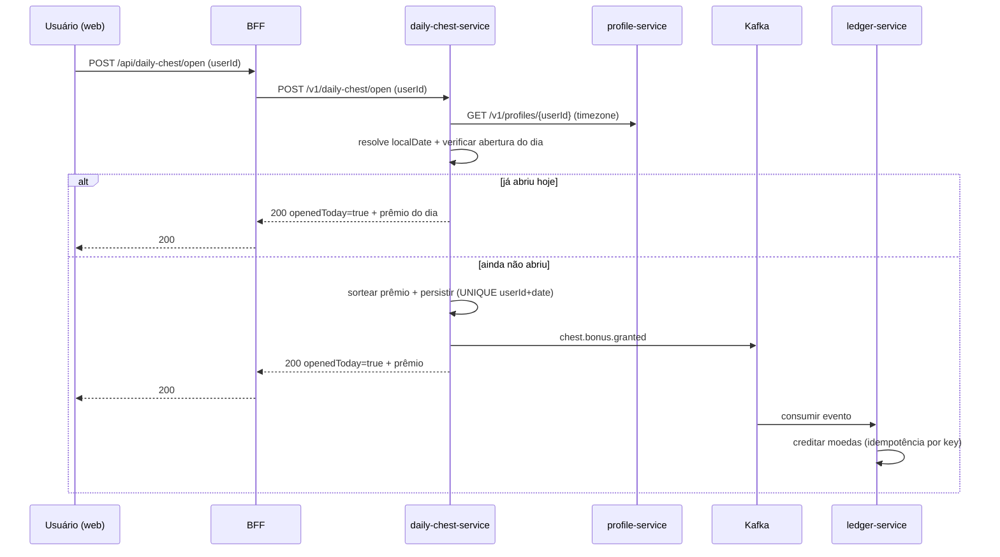
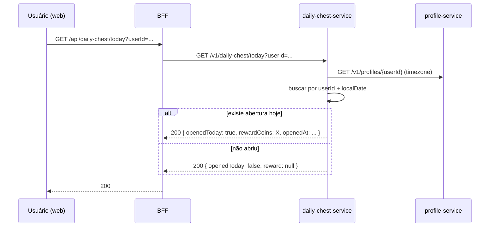

# Proposta de implementação — Baú da Sorte (novo microserviço)

## Objetivo

Criar um novo microserviço para permitir que cada utilizador abra um baú **1 vez por dia** e receba moedas por sorteio com probabilidades fixas:

- `10 moedas`: `80%`
- `50 moedas`: `15%`
- `100 moedas`: `5%`

O serviço deve:

1. validar elegibilidade diária (evitar múltiplas aberturas no mesmo dia);
2. persistir o resultado do dia;
3. publicar evento para crédito no ledger via mensageria;
4. expor endpoint para consultar o prêmio de hoje (ou vazio se ainda não abriu);
5. permitir integração simples com o frontend (badge/flutuante + animação).

---

## Escopo funcional

### Regras de negócio

- Janela diária por timezone do usuário (via `profile-service`), fallback `America/Sao_Paulo`.
- Um usuário pode abrir o baú apenas **uma vez por data local**.
- Abertura é definitiva: após abrir no dia, consultas do dia retornam o mesmo prêmio.
- Crédito de moedas é assíncrono (Kafka -> `ledger-service`) com idempotência.
- Endpoint de consulta de “hoje” retorna vazio quando não houve abertura no dia.

### Distribuição probabilística

Sugestão técnica (simples e auditável):

- gerar inteiro aleatório `r` entre `1..100`;
- `1..80` => `10`
- `81..95` => `50`
- `96..100` => `100`

Isso garante exatamente 80/15/5 por tentativa.

---

## Arquitetura proposta

Novo serviço: **`daily-chest-service`**

- Porta sugerida: `8086`
- DB próprio (`daily_chest`)
- Produz evento Kafka para crédito no ledger
- Não precisa consumir eventos inicialmente

### Integração entre serviços

```mermaid
flowchart LR
  UI[web-app] -->|HTTP| BFF[bff-service]
  BFF -->|HTTP| CHEST[daily-chest-service]
  CHEST -->|HTTP (read-only)| PROFILE[profile-service]
  CHEST -->|producer| KAFKA[Kafka]
  KAFKA -->|consumer| LEDGER[ledger-service]
  LEDGER --> MYSQL_LEDGER[(MySQL ledger)]
  CHEST --> MYSQL_CHEST[(MySQL daily_chest)]
```

### Fluxo “abrir baú”



### Fluxo “consultar prêmio de hoje”



---

## Contratos de API (proposta)

### `daily-chest-service`

Base: `/v1/daily-chest`

#### `POST /open`

Request:

```json
{
  "userId": "uuid"
}
```

Response `200`:

```json
{
  "openedToday": true,
  "rewardCoins": 10,
  "localDate": "2026-04-09",
  "openedAt": "2026-04-09T11:03:44Z",
  "alreadyOpened": false
}
```

Se já abriu hoje, retorna o mesmo shape com `alreadyOpened: true` e mesmo `rewardCoins`.

#### `GET /today?userId=...`

Response `200` quando já abriu:

```json
{
  "openedToday": true,
  "rewardCoins": 50,
  "localDate": "2026-04-09",
  "openedAt": "2026-04-09T08:11:05Z"
}
```

Response `200` quando ainda não abriu:

```json
{
  "openedToday": false,
  "rewardCoins": null,
  "localDate": "2026-04-09",
  "openedAt": null
}
```

### `bff-service` (proxy)

- `POST /api/daily-chest/open`
- `GET /api/daily-chest/today?userId=...`

Sem lógica de negócio no BFF; apenas proxy + validação básica de payload.

---

## Modelo de dados (novo serviço)

Tabela sugerida: `daily_chest_openings`

- `id` (UUID, PK)
- `user_id` (UUID, not null)
- `local_date` (DATE, not null)
- `timezone` (VARCHAR(64), not null)
- `reward_coins` (INT, not null)
- `roll_value` (INT, not null) — opcional para auditoria (1..100)
- `idempotency_key` (VARCHAR(255), not null, unique)
- `created_at` (TIMESTAMP, not null)

Índice/constraint essencial:

- `UNIQUE (user_id, local_date)` para blindar concorrência.

---

## Mensageria (proposta)

### Novo tópico

- `chest.bonus.granted` (producer: `daily-chest-service`, consumer: `ledger-service`)

Payload:

```json
{
  "userId": "uuid",
  "rewardCoins": 10,
  "localDate": "2026-04-09",
  "idempotencyKey": "daily-chest:user:<uuid>:date:2026-04-09",
  "schemaVersion": 1
}
```

### Processamento no ledger

- Novo Kafka listener no `ledger-service`.
- Converte para crédito com:
  - `reason = DAILY_CHEST_BONUS`
  - `refType = DAILY_CHEST`
  - `refId = localDate`
  - `idempotencyKey` recebido no evento

Isso mantém consistência com padrão atual de crédito assíncrono e idempotente.

---

## Concorrência e idempotência

Problema: usuário clicar duas vezes rápido (ou duas abas).

Mitigações:

1. `UNIQUE(user_id, local_date)` no banco do baú.
2. Em caso de `duplicate key`, reler registro e retornar prêmio já persistido.
3. `idempotencyKey` determinística por usuário+data no evento para ledger.
4. Ledger já trata idempotência por chave única.

---

## Frontend (proposta UX)

## Componente flutuante

- Novo componente: `DailyChestFab`
- Posição: fixa canto inferior direito, acima do bottom menu.
- Exemplo de spacing: `right: 16px; bottom: calc(var(--bottom-nav-height) + 16px);`
- Estado inicial baseado em `GET /api/daily-chest/today`.

### Estados visuais

- `disponível`: baú pulsando, CTA para abrir.
- `abrindo`: modal/overlay com animação de suspense.
- `aberto hoje`: baú “desativado” + texto curto do prêmio do dia.

### Animação de suspense

Sequência proposta:

1. clique no baú abre modal;
2. 1.5s a 2.5s de animação (shake/glow + partículas simples);
3. chamada `POST /api/daily-chest/open` durante animação;
4. reveal do resultado (10/50/100);
5. atualizar saldo em tela (`getMeBalance`).

Observação: animação é apenas visual; prêmio é definido no backend.

---

## Estrutura de código sugerida

### `daily-chest-service`

- `domain/entity/DailyChestOpening.java`
- `infra/persistence/DailyChestOpeningRepository.java`
- `domain/service/DailyChestService.java`
- `infra/resource/DailyChestResource.java`
- `infra/resource/dto/*` (`OpenChestRequest`, `DailyChestTodayResponse`, etc.)
- `infra/gateway/profile/ProfileGateway.java` (consulta timezone)
- `infra/messaging/DailyChestBonusKafkaPublisher.java`
- `infra/messaging/dto/DailyChestBonusGrantedMessage.java`

### `bff-service`

- `infra/gateway/chest/DailyChestGateway.java` + impl
- `resource/DailyChestProxyResource.java`
- `infra/resource/dto/*` espelhando o contrato

### `ledger-service`

- `infra/messaging/DailyChestBonusKafkaListener.java`
- `infra/messaging/dto/DailyChestBonusGrantedMessage.java`
- extensão do mapper para `toDailyChestBonusLine(...)`

### `web-app`

- `src/api.js` (`getDailyChestToday`, `openDailyChest`)
- `src/components/DailyChestFab.jsx`
- estilos em `src/styles/global.css` (ou css dedicado)
- integração no layout principal (provavelmente `App.jsx`/shell autenticado)

---

## Observabilidade e operação

- Logs estruturados no open:
  - `userId`, `localDate`, `rewardCoins`, `alreadyOpened`.
- Métricas recomendadas:
  - contagem de aberturas/dia;
  - distribuição por faixa de prêmio;
  - erros de publicação Kafka.
- Healthcheck padrão Spring (`/actuator/health`).

---

## Plano de implementação em fases

1. **Fase 1 — Backend core (daily-chest-service)**
   - criar serviço, entidade, repositório, endpoints `/today` e `/open`;
   - integração com profile timezone;
   - testes unitários de regra e probabilidade.

2. **Fase 2 — Integração**
   - BFF proxy;
   - evento Kafka + listener no ledger;
   - atualizar docs de contratos/mensagens.

3. **Fase 3 — Frontend**
   - FAB flutuante + estados;
   - animação de suspense;
   - refresh de saldo após abertura.

4. **Fase 4 — Hardening**
   - testes de concorrência (duplo clique/duas abas);
   - testes E2E básicos;
   - ajustes de UX.

---

## Decisões para validar antes de implementar

1. **Timezone oficial**: usar timezone do profile (com fallback SP) está ok?
2. **Semântica do `POST /open`**: retornar 200 com `alreadyOpened=true` (idempotente) está ok?
3. **Tópico Kafka**: podemos criar `chest.bonus.granted` (separado de referral) para manter contrato limpo?
4. **UI**: exibir baú em todas as páginas autenticadas ou só Home?
5. **Cooldown visual**: após aberto, manter FAB visível (estado “volta amanhã”) ou ocultar até o próximo dia?

---

Se você aprovar esta proposta, o próximo passo é executar a Fase 1 e Fase 2 primeiro (backend + integração), e depois a Fase 3 no frontend.
